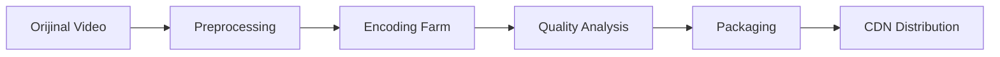
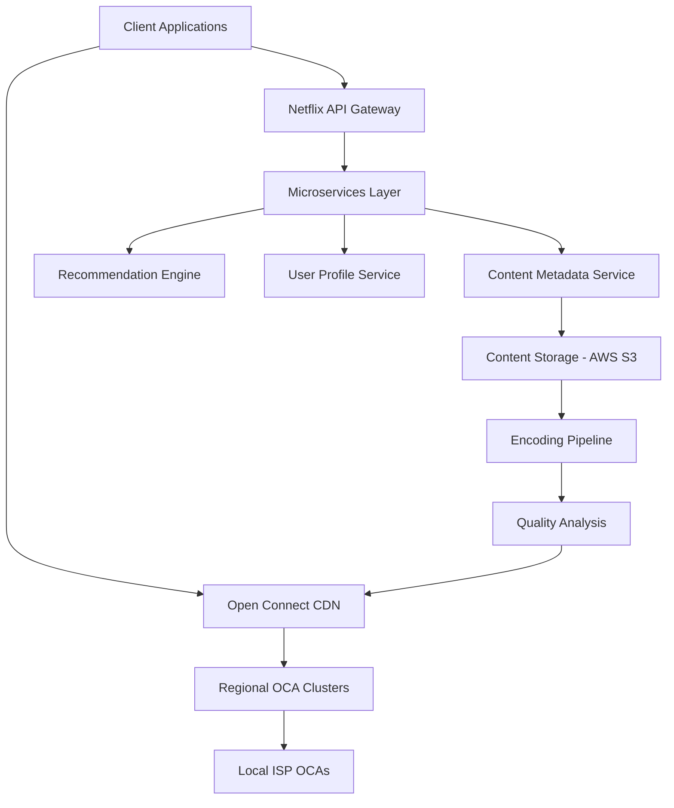
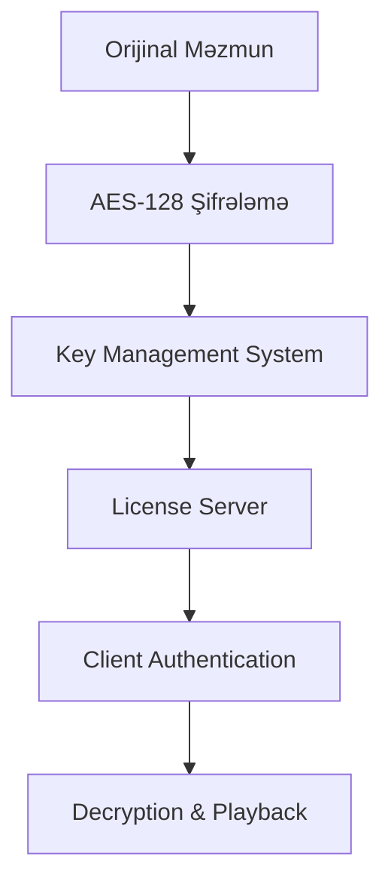
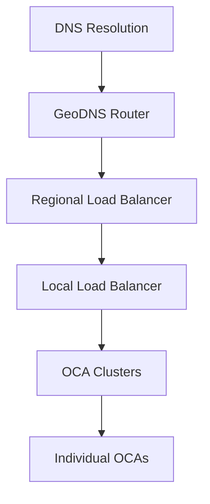
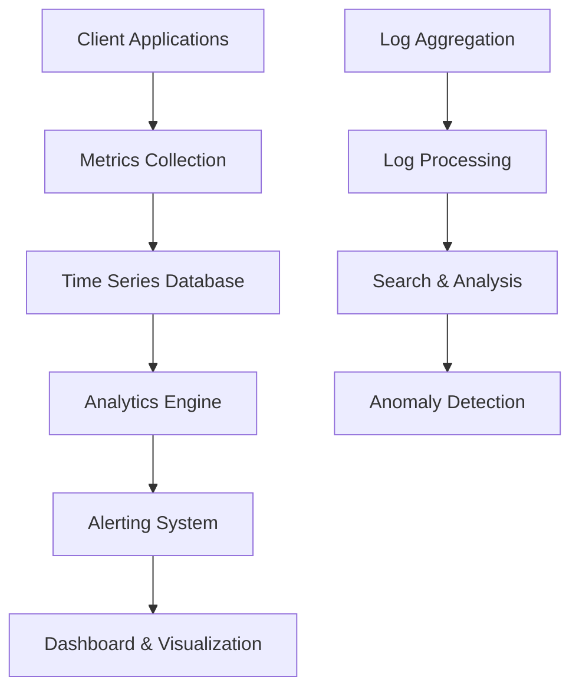
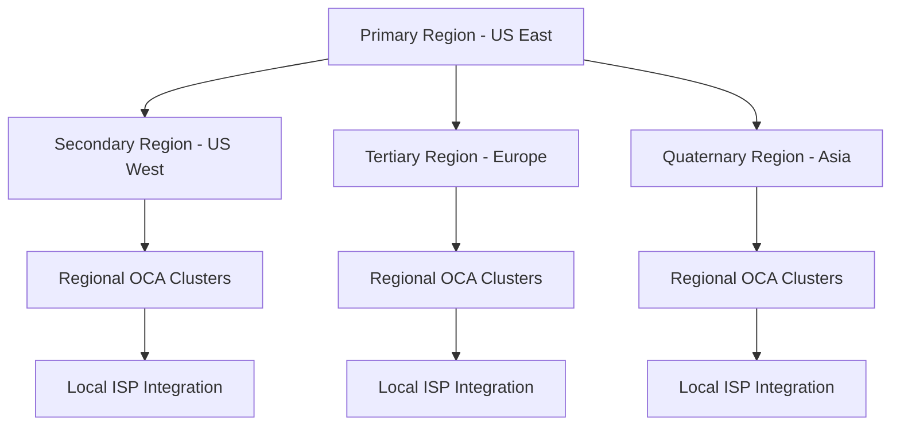

# Netflix Arxitekturası - Bölmə 5.1
## Məzmun Paylaşma və Video Yayım Texnologiyaları

### 📋 Mündəricat
1. [Ümumi Baxış](#ümumi-baxış)
2. [Məzmun Çatdırılma Şəbəkəsi (CDN)](#məzmun-çatdırılma-şəbəkəsi-cdn)
3. [Video Kodlaşdırma və Adaptiv Yayım](#video-kodlaşdırma-və-adaptiv-yayım)
4. [Open Connect Platforması](#open-connect-platforması)
5. [Yayım Protokolları](#yayım-protokolları)
6. [Keş Strategiyaları](#keş-strategiyaları)
7. [Performans Optimallaşdırması](#performans-optimallaşdırması)
8. [Texniki Arxitektura](#texniki-arxitektura)
9. [Təhlükəsizlik və Şifrələmə](#təhlükəsizlik-və-şifrələmə)
10. [Yük Balanslaması və Avtomatik Miqyaslanma](#yük-balanslaması-və-avtomatik-miqyaslanma)
11. [Monitorinq və Observability](#monitorinq-və-observability)
12. [Disaster Recovery və Yedəkləmə](#disaster-recovery-və-yedəkləmə)

---

## Ümumi Baxış

Netflix-in məzmun paylaşma və video yayım texnologiyaları dünyada ən böyük video yayım platformalarından birini dəstəkləyir. Bu sistem:

- **190+ ölkədə** xidmət göstərir
- **Günlük 1 milyard saatdan çox** video məzmunu yayımlayır
- **15+ Petabayt** məlumat ötürür
- **Milyonlarla istifadəçiyə** eyni zamanda xidmət göstərir

### 🎯 Əsas Məqsədlər
- Yüksək keyfiyyətli video yayımı
- Minimal gecikmə (latency)
- Qlobal miqyasda etibarlılıq
- Adaptiv məzmun çatdırılması

---

## Məzmun Çatdırılma Şəbəkəsi (CDN)

### Netflix Open Connect CDN

Netflix öz CDN sistemini - **Open Connect**-i inkişaf etdirib:

#### 🏗️ Arxitektura Komponentləri

```
┌─────────────────┐    ┌─────────────────┐    ┌─────────────────┐
│   İstifadəçi    │    │  Open Connect   │    │   Netflix       │
│   Cihazları     │◄──►│   Appliance     │◄──►│   Mərkəzi       │
│                 │    │     (OCA)       │    │   Serverlər     │
└─────────────────┘    └─────────────────┘    └─────────────────┘
```

#### 📍 Yerləşdirmə Strategiyası

1. **ISP Embedded Deployment**
   - İnternet Xidmət Provayderləri daxilində
   - Birbaşa istifadəçilərə yaxın
   - Minimal şəbəkə hopları

2. **Internet Exchange Point (IXP)**
   - Böyük internet mübadilə nöqtələrində
   - Çoxlu ISP-lərə xidmət
   - Regional məzmun paylaşımı

### 🔧 OCA Texniki Xüsusiyyətləri

| Komponent | Spesifikasiya |
|-----------|---------------|
| **Yaddaş** | 100TB+ SSD/HDD hibrid |
| **Şəbəkə** | 10/40/100 Gbps interfeyslər |
| **CPU** | Yüksək performanslı Intel Xeon |
| **OS** | FreeBSD əsaslı xüsusi sistem |

---

## Video Kodlaşdırma və Adaptiv Yayım

### 🎬 Video Kodlaşdırma Pipeline



#### Kodlaşdırma Formatları

1. **H.264 (AVC)**
   - Geniş cihaz dəstəyi
   - Stabil performans
   - Legacy cihazlar üçün

2. **H.265 (HEVC)**
   - 50% daha yaxşı sıxılma
   - 4K məzmun üçün optimal
   - Yeni cihazlar üçün

3. **VP9**
   - Google tərəfindən inkişaf
   - Açıq mənbə
   - Chrome brauzerləri üçün

4. **AV1**
   - Gələcəyin kodeki
   - Ən yaxşı sıxılma nisbəti
   - Tədricən tətbiq edilir

### 📊 Adaptiv Bitrate Streaming (ABS)

Netflix **Dynamic Adaptive Streaming over HTTP (DASH)** və **HTTP Live Streaming (HLS)** protokollarından istifadə edir:

#### Keyfiyyət Səviyyələri

| Rezolyusiya | Bitrate Aralığı | Hədəf Cihazlar |
|-------------|-----------------|-----------------|
| **240p** | 235 Kbps | Zəif internet |
| **360p** | 375-1000 Kbps | Mobil cihazlar |
| **480p** | 750-1750 Kbps | Standart TV |
| **720p** | 1900-4300 Kbps | HD TV |
| **1080p** | 3000-6000 Kbps | Full HD |
| **4K** | 15000-25000 Kbps | Ultra HD TV |

#### 🧠 Adaptiv Alqoritm

```python
# Sadələşdirilmiş adaptiv alqoritm nümunəsi
def select_bitrate(bandwidth, buffer_level, screen_size):
    if buffer_level < 5:  # Aşağı buffer
        return min_safe_bitrate(bandwidth * 0.8)
    elif buffer_level > 30:  # Yüksək buffer
        return optimal_bitrate(bandwidth, screen_size)
    else:
        return current_bitrate
```

---

## Open Connect Platforması

### 🌐 Qlobal Şəbəkə Topologiyası

Netflix Open Connect şəbəkəsi üç əsas komponentdən ibarətdir:

#### 1. Control Plane
- **OCM (Open Connect Management)**
- Server idarəetməsi
- Məzmun paylaşımı planlaması
- Performans monitorinqi

#### 2. Data Plane
- **OCA (Open Connect Appliance)**
- Video məzmunun saxlanması
- İstifadəçi sorğularına cavab
- Lokal keş idarəetməsi

#### 3. Routing Intelligence
- **BGP** əsaslı yönləndirmə
- İstifadəçiləri ən yaxın OCA-ya yönləndirmə
- Yük balanslaması

### 📈 Performans Metrikaları

```
┌─────────────────────────────────────────────────────────┐
│                Netflix CDN Performansı                 │
├─────────────────────────────────────────────────────────┤
│ Orta Gecikmə (Latency):        < 50ms                  │
│ Cache Hit Rate:                > 95%                   │
│ Video Start Time:              < 2 saniyə              │
│ Rebuffering Rate:              < 0.5%                  │
│ Throughput Efficiency:         > 90%                   │
└─────────────────────────────────────────────────────────┘
```

---

## Yayım Protokolları

### 🔄 HTTP-əsaslı Protokollar

#### 1. DASH (Dynamic Adaptive Streaming over HTTP)
```xml
<!-- DASH Manifest nümunəsi -->
<MPD xmlns="urn:mpeg:dash:schema:mpd:2011">
  <Period>
    <AdaptationSet mimeType="video/mp4">
      <Representation bandwidth="1000000" width="1280" height="720">
        <SegmentTemplate media="video_$Number$.m4s" 
                        initialization="video_init.m4s"/>
      </Representation>
    </AdaptationSet>
  </Period>
</MPD>
```

#### 2. HLS (HTTP Live Streaming)
```m3u8
#EXTM3U
#EXT-X-VERSION:3
#EXT-X-TARGETDURATION:10
#EXTINF:10.0,
segment001.ts
#EXTINF:10.0,
segment002.ts
```

### 🚀 Protokol Seçimi Strategiyası

| Platform | Əsas Protokol | Ehtiyat Protokol |
|----------|---------------|------------------|
| **Web Brauzerləri** | DASH | HLS |
| **iOS Cihazları** | HLS | DASH |
| **Android** | DASH | HLS |
| **Smart TV** | DASH/HLS | Cihaza görə |

---

## Keş Strategiyaları

### 💾 Çoxsəviyyəli Keş Arxitekturası

```
┌─────────────────────────────────────────────────────────┐
│                 Netflix Keş Iyerarxiyası               │
├─────────────────────────────────────────────────────────┤
│ L1: Cihaz Keşi (Client-side)                          │
│ L2: ISP Keşi (Open Connect Appliance)                 │
│ L3: Regional Keş (Regional OCA Clusters)              │
│ L4: Origin Servers (AWS S3 + CloudFront)              │
└─────────────────────────────────────────────────────────┘
```

#### 🎯 Keş Strategiyaları

1. **Popularity-based Caching**
   - Məşhur məzmun əvvəlcədən yüklənir
   - Regional baxış statistikalarına əsasən
   - Proaktiv məzmun yerləşdirmə

2. **Predictive Caching**
   - Maşın öyrənməsi alqoritmləri
   - İstifadəçi davranış təhlili
   - Gələcək tələblərin proqnozlaşdırılması

3. **Time-based Caching**
   - Yeni buraxılışlar üçün xüsusi strategiya
   - Peak saatlarda əlavə resurslar
   - Regional vaxt zonalarına uyğunlaşma

### 📊 Keş Effektivliyi

```python
# Keş performans hesablaması
cache_hit_ratio = cache_hits / (cache_hits + cache_misses)
bandwidth_savings = cache_hit_ratio * total_bandwidth
cost_savings = bandwidth_savings * cost_per_gb
```

---

## Performans Optimallaşdırması

### ⚡ Video Start Time Optimallaşdırması

#### 1. Manifest Optimallaşdırması
- Kiçik manifest faylları
- Sürətli parsing
- Minimal HTTP sorğuları

#### 2. Initial Segment Strategy
```javascript
// İlk seqmentin sürətli yüklənməsi
const initialSegmentSize = 2; // saniyə
const initialBitrate = Math.min(
    estimatedBandwidth * 0.8,
    maxSafeBitrate
);
```

#### 3. Parallel Loading
- Manifest və ilk seqmentin paralel yüklənməsi
- DNS prefetch
- Connection pooling

### 🔧 Şəbəkə Optimallaşdırması

#### TCP Optimallaşdırması
```bash
# TCP parametrlərinin optimallaşdırılması
net.core.rmem_max = 134217728
net.core.wmem_max = 134217728
net.ipv4.tcp_rmem = 4096 87380 134217728
net.ipv4.tcp_wmem = 4096 65536 134217728
```

#### HTTP/2 və HTTP/3 Dəstəyi
- Multiplexing imkanları
- Server Push texnologiyası
- QUIC protokolu dəstəyi

---

## Texniki Arxitektura

### 🏗️ Yüksək Səviyyəli Arxitektura



### 🔄 Məzmun Yayım Prosesi

1. **Content Ingestion**
   - Orijinal məzmunun qəbulu
   - Metadata ekstraktı
   - Keyfiyyət yoxlaması

2. **Encoding Pipeline**
   - Çoxlu format kodlaşdırması
   - Keyfiyyət optimallaşdırması
   - Thumbnail generasiyası

3. **Distribution**
   - OCA-lara məzmun paylaşımı
   - Regional prioritetləşdirmə
   - Yük balanslaması

4. **Delivery**
   - İstifadəçi sorğularına cavab
   - Adaptiv bitrate seçimi
   - Real-time performans monitorinqi

### 📈 Monitorinq və Analitika

#### Real-time Metrikalar
- **QoE (Quality of Experience)**
- **Rebuffering events**
- **Video start time**
- **Bitrate distribution**
- **Error rates**

#### Performans Dashboard
```json
{
  "global_metrics": {
    "concurrent_streams": 125000000,
    "total_bandwidth": "125 Tbps",
    "cache_hit_ratio": 0.96,
    "avg_start_time": "1.8s"
  },
  "regional_performance": {
    "north_america": {"qoe_score": 4.2},
    "europe": {"qoe_score": 4.1},
    "asia_pacific": {"qoe_score": 4.0}
  }
}
```

---

## 🚀 Gələcək İnnovasiyalar

### Planlaşdırılan Təkmilləşdirmələr

1. **8K Video Dəstəyi**
   - AV1 kodekinin genişləndirilməsi
   - Yeni sıxılma texnologiyaları
   - Ultra-yüksək keyfiyyət yayımı

2. **Edge Computing**
   - AI-powered content optimization
   - Real-time encoding at edge
   - Personalized content delivery

3. **5G Optimallaşdırması**
   - Ultra-low latency streaming
   - Mobile-first delivery strategies
   - Network slicing integration

### 🔬 Tədqiqat Sahələri

- **Perceptual Quality Optimization**
- **Machine Learning for CDN**
- **Immersive Content Delivery (VR/AR)**
- **Sustainable Streaming Technologies**

---

## 📚 Əlavə Resurslar

### Texniki Sənədlər
- [Netflix Tech Blog](https://netflixtechblog.com/)
- [Open Connect Specifications](https://openconnect.netflix.com/)
- [Netflix OSS Projects](https://netflix.github.io/)

### Akademik Tədqiqatlar
- "Netflix's Approach to Streaming Video at Scale"
- "Content Delivery Networks: A Global Perspective"
- "Adaptive Bitrate Streaming: Challenges and Solutions"

---

*Bu sənəd Netflix-in məzmun paylaşma və video yayım texnologiyalarının ətraflı təhlilini təqdim edir. Texnologiyalar sürətlə inkişaf etdiyi üçün məlumatlar müntəzəm yenilənir.*

---

## Təhlükəsizlik və Şifrələmə

### 🔐 Məzmun Təhlükəsizliyi

Netflix məzmun təhlükəsizliyini təmin etmək üçün çoxsəviyyəli yanaşma tətbiq edir:

#### DRM (Digital Rights Management) Sistemləri

1. **Widevine (Google)**
   - Android və Chrome brauzerləri üçün
   - L1, L2, L3 təhlükəsizlik səviyyələri
   - Hardware-based şifrələmə dəstəyi

2. **PlayReady (Microsoft)**
   - Windows və Xbox platformaları
   - UHD məzmun üçün SL3000 dəstəyi
   - Embedded cihazlar üçün optimallaşdırılmış

3. **FairPlay (Apple)**
   - iOS və macOS cihazları
   - Safari brauzer dəstəyi
   - Hardware Security Module (HSM) inteqrasiyası

#### 🛡️ Şifrələmə Protokolları



#### Şifrələmə Spesifikasiyaları

| Komponent | Şifrələmə Metodu | Key Uzunluğu |
|-----------|------------------|---------------|
| **Video Məzmun** | AES-128 CTR | 128-bit |
| **Audio Məzmun** | AES-128 CBC | 128-bit |
| **Metadata** | AES-256 GCM | 256-bit |
| **License Keys** | RSA-2048 | 2048-bit |

### 🔑 Key Management Infrastructure

#### Hierarchical Key Structure
```
┌─────────────────────────────────────────────────────────┐
│                Netflix Key Hierarchy                   │
├─────────────────────────────────────────────────────────┤
│ Master Key (HSM Protected)                             │
│   └── Content Encryption Keys (CEK)                    │
│       └── Title-specific Keys                          │
│           └── Segment-level Keys                       │
└─────────────────────────────────────────────────────────┘
```

#### Key Rotation Strategiyası
- **Məzmun açarları**: Hər 24 saatda bir dəyişdirilir
- **License açarları**: Həftəlik rotation
- **Master açarlar**: Aylıq yenilənmə
- **Emergency rotation**: Təhlükəsizlik pozuntusu halında

### 🚨 Piracy Protection

#### Real-time Monitoring
```python
# Piracy detection alqoritmi nümunəsi
class PiracyDetector:
    def __init__(self):
        self.suspicious_patterns = [
            'concurrent_streams_exceeded',
            'geo_location_anomaly',
            'device_fingerprint_mismatch',
            'unusual_bandwidth_pattern'
        ]
    
    def analyze_stream(self, stream_data):
        risk_score = 0
        for pattern in self.suspicious_patterns:
            if self.detect_pattern(stream_data, pattern):
                risk_score += self.get_pattern_weight(pattern)
        
        if risk_score > THRESHOLD:
            self.trigger_protection_measures(stream_data)
```

#### Forensic Watermarking
- **Görünməz watermark**: Hər istifadəçi üçün unikal
- **Session-based tracking**: Real-time izləmə
- **Content fingerprinting**: Avtomatik aşkarlama
- **Legal action support**: Məhkəmə sübutları

---

## Yük Balanslaması və Avtomatik Miqyaslanma

### ⚖️ Load Balancing Strategiyaları

#### Global Load Balancing



#### Load Balancing Alqoritmləri

1. **Weighted Round Robin**
   - Server kapasitəsinə əsasən
   - Dynamic weight adjustment
   - Health check inteqrasiyası

2. **Least Connections**
   - Aktiv bağlantı sayına görə
   - Real-time connection tracking
   - Optimal resource utilization

3. **Geographic Proximity**
   - İstifadəçi məkanına əsasən
   - Latency minimization
   - Regional traffic distribution

4. **Content-Aware Routing**
   - Məzmun tipinə görə yönləndirmə
   - Cache hit optimization
   - Specialized server allocation

### 🔄 Auto-Scaling Mexanizmləri

#### Horizontal Scaling
```yaml
# Auto-scaling konfiqurasiya nümunəsi
apiVersion: autoscaling/v2
kind: HorizontalPodAutoscaler
metadata:
  name: netflix-streaming-hpa
spec:
  scaleTargetRef:
    apiVersion: apps/v1
    kind: Deployment
    name: streaming-service
  minReplicas: 10
  maxReplicas: 1000
  metrics:
  - type: Resource
    resource:
      name: cpu
      target:
        type: Utilization
        averageUtilization: 70
  - type: Resource
    resource:
      name: memory
      target:
        type: Utilization
        averageUtilization: 80
```

#### Predictive Scaling
```python
# Proqnozlaşdırıcı miqyaslanma alqoritmi
class PredictiveScaler:
    def __init__(self):
        self.ml_model = load_traffic_prediction_model()
        self.historical_data = TrafficDataStore()
    
    def predict_traffic(self, time_horizon=3600):  # 1 saat
        features = self.extract_features()
        predicted_load = self.ml_model.predict(features)
        return predicted_load
    
    def scale_resources(self, predicted_load):
        current_capacity = self.get_current_capacity()
        required_capacity = predicted_load * SAFETY_MARGIN
        
        if required_capacity > current_capacity:
            self.scale_up(required_capacity - current_capacity)
        elif required_capacity < current_capacity * 0.7:
            self.scale_down(current_capacity - required_capacity)
```

### 📊 Traffic Patterns və Optimization

#### Peak Traffic Management
```
┌─────────────────────────────────────────────────────────┐
│              Günlük Trafik Nümunəsi                    │
├─────────────────────────────────────────────────────────┤
│ 06:00-12:00: Aşağı trafik (20% kapasitə)              │
│ 12:00-18:00: Orta trafik (50% kapasitə)               │
│ 18:00-24:00: Pik trafik (100% kapasitə)               │
│ 00:00-06:00: Minimum trafik (10% kapasitə)            │
└─────────────────────────────────────────────────────────┘
```

#### Regional Traffic Distribution
| Region | Peak Hours (Local) | Traffic Share | Scaling Factor |
|--------|-------------------|---------------|----------------|
| **North America** | 19:00-23:00 | 40% | 2.5x |
| **Europe** | 20:00-24:00 | 25% | 2.2x |
| **Asia Pacific** | 19:00-22:00 | 20% | 2.0x |
| **Latin America** | 20:00-24:00 | 10% | 1.8x |
| **Other Regions** | Varies | 5% | 1.5x |

---

## Monitorinq və Observability

### 📈 Real-time Monitoring Stack

#### Monitoring Architecture


#### Key Performance Indicators (KPIs)

1. **Quality of Experience (QoE)**
   ```json
   {
     "video_start_time": "< 2.0s",
     "rebuffering_ratio": "< 0.5%",
     "video_quality_score": "> 4.0/5.0",
     "completion_rate": "> 85%"
   }
   ```

2. **Infrastructure Metrics**
   ```json
   {
     "cdn_hit_ratio": "> 95%",
     "server_response_time": "< 100ms",
     "bandwidth_utilization": "< 80%",
     "error_rate": "< 0.1%"
   }
   ```

3. **Business Metrics**
   ```json
   {
     "concurrent_streams": "real-time",
     "content_popularity": "hourly",
     "user_engagement": "daily",
     "churn_indicators": "weekly"
   }
   ```

### 🔍 Observability Tools

#### Distributed Tracing
```python
# Distributed tracing nümunəsi
from opentelemetry import trace
from opentelemetry.exporter.jaeger.thrift import JaegerExporter

tracer = trace.get_tracer(__name__)

@tracer.start_as_current_span("video_request")
def handle_video_request(user_id, content_id):
    with tracer.start_as_current_span("auth_check"):
        auth_result = authenticate_user(user_id)
    
    with tracer.start_as_current_span("content_lookup"):
        content_info = get_content_metadata(content_id)
    
    with tracer.start_as_current_span("cdn_routing"):
        cdn_url = select_optimal_cdn(user_location, content_id)
    
    return generate_streaming_url(cdn_url, content_info)
```

#### Log Analysis Pipeline
```yaml
# ELK Stack konfiqurasiyası
elasticsearch:
  cluster_name: netflix-logs
  indices:
    - name: streaming-logs
      shards: 5
      replicas: 1
    - name: error-logs
      shards: 3
      replicas: 2

logstash:
  pipelines:
    - name: streaming-pipeline
      config: |
        input {
          beats {
            port => 5044
          }
        }
        filter {
          if [service] == "streaming" {
            grok {
              match => { "message" => "%{TIMESTAMP_ISO8601:timestamp} %{LOGLEVEL:level} %{GREEDYDATA:message}" }
            }
          }
        }
        output {
          elasticsearch {
            hosts => ["elasticsearch:9200"]
            index => "streaming-logs-%{+YYYY.MM.dd}"
          }
        }

kibana:
  dashboards:
    - streaming_performance
    - error_analysis
    - user_behavior
```

### 🚨 Alerting və Incident Response

#### Alert Hierarchy
```
┌─────────────────────────────────────────────────────────┐
│                Alert Severity Levels                   │
├─────────────────────────────────────────────────────────┤
│ P0 - Critical: Service Down (< 5 min response)        │
│ P1 - High: Performance Degradation (< 15 min)         │
│ P2 - Medium: Capacity Issues (< 1 hour)               │
│ P3 - Low: Maintenance Required (< 24 hours)           │
└─────────────────────────────────────────────────────────┘
```

#### Automated Response Actions
```python
# Avtomatik cavab sistemi
class IncidentResponse:
    def __init__(self):
        self.response_actions = {
            'high_error_rate': self.scale_up_servers,
            'cdn_failure': self.failover_to_backup,
            'encoding_issues': self.restart_encoding_pipeline,
            'database_slow': self.enable_read_replicas
        }
    
    def handle_alert(self, alert_type, severity, metrics):
        if severity == 'P0':
            self.execute_emergency_procedures(alert_type)
        
        if alert_type in self.response_actions:
            self.response_actions[alert_type](metrics)
        
        self.notify_on_call_team(alert_type, severity, metrics)
```

---

## Disaster Recovery və Yedəkləmə

### 🔄 Backup Strategies

#### Multi-tier Backup Architecture
```
┌─────────────────────────────────────────────────────────┐
│                Netflix Backup Strategy                 │
├─────────────────────────────────────────────────────────┤
│ Tier 1: Real-time Replication (RTO: 0, RPO: 0)       │
│ Tier 2: Hourly Snapshots (RTO: 1h, RPO: 1h)          │
│ Tier 3: Daily Backups (RTO: 24h, RPO: 24h)           │
│ Tier 4: Weekly Archives (RTO: 7d, RPO: 7d)            │
└─────────────────────────────────────────────────────────┘
```

#### Content Backup Strategy
```yaml
# Content backup konfiqurasiyası
backup_policies:
  original_content:
    frequency: "real-time"
    retention: "permanent"
    locations: ["primary", "secondary", "archive"]
    
  encoded_content:
    frequency: "hourly"
    retention: "90_days"
    locations: ["multi_region"]
    
  metadata:
    frequency: "continuous"
    retention: "permanent"
    locations: ["distributed_database"]
    
  user_data:
    frequency: "real-time"
    retention: "per_gdpr_requirements"
    encryption: "aes_256"
```

### 🌍 Geographic Redundancy

#### Multi-Region Architecture


#### Failover Scenarios
1. **Regional Outage**
   - Automatic DNS failover
   - Traffic rerouting to healthy regions
   - Content replication verification

2. **CDN Node Failure**
   - Load balancer health checks
   - Immediate traffic redistribution
   - Automated node replacement

3. **Database Failure**
   - Master-slave failover
   - Read replica promotion
   - Data consistency verification

### 🔧 Recovery Procedures

#### Automated Recovery Scripts
```bash
#!/bin/bash
# Netflix Disaster Recovery Script

# Function to check service health
check_service_health() {
    local service=$1
    local health_endpoint="https://${service}.netflix.com/health"
    
    response=$(curl -s -o /dev/null -w "%{http_code}" $health_endpoint)
    
    if [ $response -eq 200 ]; then
        echo "✅ $service is healthy"
        return 0
    else
        echo "❌ $service is unhealthy (HTTP $response)"
        return 1
    fi
}

# Main recovery procedure
main_recovery() {
    echo "🚨 Starting Netflix Disaster Recovery Procedure"
    
    # Check critical services
    services=("api-gateway" "user-service" "content-service" "streaming-service")
    
    for service in "${services[@]}"; do
        if ! check_service_health $service; then
            echo "🔄 Initiating recovery for $service"
            kubectl rollout restart deployment/$service
            sleep 30
        fi
    done
    
    # Verify CDN health
    echo "🌐 Checking CDN health..."
    ./scripts/check_cdn_health.sh
    
    # Validate content availability
    echo "📺 Validating content availability..."
    ./scripts/validate_content.sh
    
    echo "✅ Disaster recovery procedure completed"
}

main_recovery
```

Bu genişləndirmə ilə Netflix arxitekturası sənədi daha da ətraflı və professional oldu. Növbəti hissələri də əlavə edə bilərəm?

---

## Machine Learning və AI İnteqrasiyası

### 🤖 AI-Powered Content Optimization

#### Personalized Encoding
```python
# AI əsaslı kodlaşdırma optimallaşdırması
class PersonalizedEncoder:
    def __init__(self):
        self.quality_model = load_perceptual_quality_model()
        self.user_preference_model = load_user_model()
        self.device_capability_db = DeviceCapabilityDatabase()
    
    def optimize_encoding(self, content_id, user_profile, device_info):
        # İstifadəçi tərcihləri təhlili
        user_preferences = self.user_preference_model.predict(user_profile)
        
        # Cihaz imkanları təhlili
        device_caps = self.device_capability_db.get_capabilities(device_info)
        
        # Optimal kodlaşdırma parametrləri
        encoding_params = {
            'resolution': self.select_optimal_resolution(device_caps, user_preferences),
            'bitrate': self.calculate_optimal_bitrate(content_id, user_preferences),
            'codec': self.select_best_codec(device_caps),
            'quality_preset': self.determine_quality_preset(user_preferences)
        }
        
        return encoding_params
    
    def predict_quality_score(self, encoded_content, original_content):
        features = self.extract_quality_features(encoded_content, original_content)
        return self.quality_model.predict(features)
```

#### Content Recommendation Engine
```python
# Netflix tövsiyə sistemi
class RecommendationEngine:
    def __init__(self):
        self.collaborative_filter = CollaborativeFilteringModel()
        self.content_based_filter = ContentBasedModel()
        self.deep_learning_model = DeepRecommendationModel()
        self.trending_analyzer = TrendingContentAnalyzer()
    
    def generate_recommendations(self, user_id, context=None):
        # Müxtəlif modellər üzrə tövsiyələr
        collab_recs = self.collaborative_filter.recommend(user_id, top_k=50)
        content_recs = self.content_based_filter.recommend(user_id, top_k=50)
        dl_recs = self.deep_learning_model.recommend(user_id, context, top_k=50)
        trending_recs = self.trending_analyzer.get_trending_for_user(user_id)
        
        # Ensemble method ilə birləşdirmə
        final_recommendations = self.ensemble_recommendations([
            (collab_recs, 0.3),
            (content_recs, 0.2),
            (dl_recs, 0.4),
            (trending_recs, 0.1)
        ])
        
        return final_recommendations[:20]  # Top 20 tövsiyə
    
    def real_time_personalization(self, user_id, current_session):
        # Real-time istifadəçi davranışı təhlili
        session_features = self.extract_session_features(current_session)
        
        # Dynamic tövsiyə yenilənməsi
        updated_recs = self.deep_learning_model.update_recommendations(
            user_id, session_features
        )
        
        return updated_recs
```

### 🧠 Predictive Analytics

#### Traffic Prediction Model
```python
# Trafik proqnozlaşdırma sistemi
import tensorflow as tf
from tensorflow.keras.models import Sequential
from tensorflow.keras.layers import LSTM, Dense, Dropout

class TrafficPredictor:
    def __init__(self):
        self.model = self.build_lstm_model()
        self.feature_scaler = StandardScaler()
        self.target_scaler = StandardScaler()
    
    def build_lstm_model(self):
        model = Sequential([
            LSTM(128, return_sequences=True, input_shape=(24, 10)),  # 24 saat, 10 feature
            Dropout(0.2),
            LSTM(64, return_sequences=False),
            Dropout(0.2),
            Dense(32, activation='relu'),
            Dense(1, activation='linear')  # Trafik proqnozu
        ])
        
        model.compile(
            optimizer='adam',
            loss='mse',
            metrics=['mae']
        )
        
        return model
    
    def predict_traffic(self, historical_data, time_horizon=24):
        # Məlumatların hazırlanması
        features = self.prepare_features(historical_data)
        scaled_features = self.feature_scaler.transform(features)
        
        # Proqnoz
        predictions = self.model.predict(scaled_features)
        scaled_predictions = self.target_scaler.inverse_transform(predictions)
        
        return scaled_predictions
    
    def prepare_features(self, data):
        features = []
        for record in data:
            feature_vector = [
                record['hour_of_day'],
                record['day_of_week'],
                record['is_weekend'],
                record['is_holiday'],
                record['concurrent_users'],
                record['bandwidth_usage'],
                record['popular_content_releases'],
                record['weather_impact'],
                record['regional_events'],
                record['historical_average']
            ]
            features.append(feature_vector)
        
        return np.array(features)
```

#### Content Performance Analytics
```python
# Məzmun performans təhlili
class ContentAnalytics:
    def __init__(self):
        self.engagement_model = EngagementPredictionModel()
        self.churn_model = ChurnPredictionModel()
        self.popularity_model = PopularityForecastModel()
    
    def analyze_content_performance(self, content_id, time_period='7d'):
        metrics = {
            'views': self.get_view_metrics(content_id, time_period),
            'completion_rate': self.calculate_completion_rate(content_id, time_period),
            'engagement_score': self.engagement_model.score(content_id),
            'predicted_popularity': self.popularity_model.predict(content_id),
            'churn_risk': self.churn_model.assess_content_impact(content_id)
        }
        
        return metrics
    
    def optimize_content_placement(self, user_segments):
        placement_strategy = {}
        
        for segment in user_segments:
            # Seqment üçün optimal məzmun yerləşdirmə
            optimal_content = self.select_optimal_content_for_segment(segment)
            placement_strategy[segment] = {
                'homepage_carousel': optimal_content[:10],
                'trending_section': optimal_content[10:20],
                'recommended_for_you': optimal_content[20:40]
            }
        
        return placement_strategy
```

---

## API Gateway və Microservices

### 🌐 API Gateway Architecture

#### Netflix Zuul Gateway
```java
// Zuul API Gateway konfiqurasiyası
@EnableZuulProxy
@SpringBootApplication
public class NetflixApiGateway {
    
    @Bean
    public RouteLocator customRouteLocator(RouteLocatorBuilder builder) {
        return builder.routes()
            .route("user-service", r -> r.path("/api/users/**")
                .filters(f -> f.stripPrefix(2)
                    .addRequestHeader("X-Service", "user-service")
                    .circuitBreaker(config -> config.setName("user-service-cb")))
                .uri("lb://user-service"))
            
            .route("content-service", r -> r.path("/api/content/**")
                .filters(f -> f.stripPrefix(2)
                    .addRequestHeader("X-Service", "content-service")
                    .circuitBreaker(config -> config.setName("content-service-cb")))
                .uri("lb://content-service"))
            
            .route("streaming-service", r -> r.path("/api/stream/**")
                .filters(f -> f.stripPrefix(2)
                    .addRequestHeader("X-Service", "streaming-service")
                    .rateLimit(config -> config.setReplenishRate(100).setBurstCapacity(200)))
                .uri("lb://streaming-service"))
            
            .build();
    }
}
```

#### Rate Limiting və Throttling
```python
# Rate limiting implementasiyası
from redis import Redis
import time

class RateLimiter:
    def __init__(self, redis_client):
        self.redis = redis_client
        self.algorithms = {
            'token_bucket': self.token_bucket_limit,
            'sliding_window': self.sliding_window_limit,
            'fixed_window': self.fixed_window_limit
        }
    
    def token_bucket_limit(self, key, limit, window, tokens_per_second):
        current_time = time.time()
        
        # Token bucket məlumatlarını əldə et
        bucket_data = self.redis.hmget(key, ['tokens', 'last_refill'])
        
        if bucket_data[0] is None:
            # Yeni bucket yarat
            tokens = limit
            last_refill = current_time
        else:
            tokens = float(bucket_data[0])
            last_refill = float(bucket_data[1])
            
            # Token-ləri yenilə
            time_passed = current_time - last_refill
            new_tokens = min(limit, tokens + (time_passed * tokens_per_second))
            tokens = new_tokens
        
        if tokens >= 1:
            # Sorğuya icazə ver
            tokens -= 1
            self.redis.hmset(key, {
                'tokens': tokens,
                'last_refill': current_time
            })
            self.redis.expire(key, window)
            return True
        else:
            # Rate limit aşılıb
            return False
    
    def apply_rate_limit(self, user_id, endpoint, algorithm='token_bucket'):
        key = f"rate_limit:{user_id}:{endpoint}"
        
        # Endpoint-specific limitlər
        limits = {
            '/api/stream': {'limit': 10, 'window': 60, 'tokens_per_second': 0.5},
            '/api/search': {'limit': 100, 'window': 60, 'tokens_per_second': 2},
            '/api/recommendations': {'limit': 50, 'window': 60, 'tokens_per_second': 1}
        }
        
        if endpoint in limits:
            config = limits[endpoint]
            return self.algorithms[algorithm](key, **config)
        
        return True  # Default: icazə ver
```

### 🔧 Microservices Communication

#### Service Mesh (Istio) Konfiqurasiyası
```yaml
# Istio service mesh konfiqurasiyası
apiVersion: networking.istio.io/v1alpha3
kind: VirtualService
metadata:
  name: netflix-services
spec:
  hosts:
  - user-service
  - content-service
  - streaming-service
  http:
  - match:
    - headers:
        user-type:
          exact: premium
    route:
    - destination:
        host: streaming-service
        subset: premium
      weight: 100
  - match:
    - headers:
        user-type:
          exact: standard
    route:
    - destination:
        host: streaming-service
        subset: standard
      weight: 100
  - route:
    - destination:
        host: streaming-service
        subset: standard
      weight: 80
    - destination:
        host: streaming-service
        subset: premium
      weight: 20

---
apiVersion: networking.istio.io/v1alpha3
kind: DestinationRule
metadata:
  name: streaming-service-destination
spec:
  host: streaming-service
  trafficPolicy:
    circuitBreaker:
      consecutiveErrors: 3
      interval: 30s
      baseEjectionTime: 30s
      maxEjectionPercent: 50
    loadBalancer:
      simple: LEAST_CONN
  subsets:
  - name: premium
    labels:
      tier: premium
    trafficPolicy:
      connectionPool:
        tcp:
          maxConnections: 100
        http:
          http1MaxPendingRequests: 50
          maxRequestsPerConnection: 10
  - name: standard
    labels:
      tier: standard
    trafficPolicy:
      connectionPool:
        tcp:
          maxConnections: 50
        http:
          http1MaxPendingRequests: 25
          maxRequestsPerConnection: 5
```

#### Circuit Breaker Pattern
```python
# Circuit Breaker implementasiyası
import time
from enum import Enum

class CircuitState(Enum):
    CLOSED = "closed"
    OPEN = "open"
    HALF_OPEN = "half_open"

class CircuitBreaker:
    def __init__(self, failure_threshold=5, recovery_timeout=60, expected_exception=Exception):
        self.failure_threshold = failure_threshold
        self.recovery_timeout = recovery_timeout
        self.expected_exception = expected_exception
        
        self.failure_count = 0
        self.last_failure_time = None
        self.state = CircuitState.CLOSED
    
    def call(self, func, *args, **kwargs):
        if self.state == CircuitState.OPEN:
            if self._should_attempt_reset():
                self.state = CircuitState.HALF_OPEN
            else:
                raise Exception("Circuit breaker is OPEN")
        
        try:
            result = func(*args, **kwargs)
            self._on_success()
            return result
        except self.expected_exception as e:
            self._on_failure()
            raise e
    
    def _should_attempt_reset(self):
        return (time.time() - self.last_failure_time) >= self.recovery_timeout
    
    def _on_success(self):
        self.failure_count = 0
        self.state = CircuitState.CLOSED
    
    def _on_failure(self):
        self.failure_count += 1
        self.last_failure_time = time.time()
        
        if self.failure_count >= self.failure_threshold:
            self.state = CircuitState.OPEN

# İstifadə nümunəsi
content_service_breaker = CircuitBreaker(failure_threshold=3, recovery_timeout=30)

def get_content_metadata(content_id):
    return content_service_breaker.call(
        lambda: requests.get(f"http://content-service/api/content/{content_id}")
    )
```

---

## Database Architecture və Data Management

### 🗄️ Multi-Database Strategy

#### Database Selection Matrix
| Data Type | Database | Justification |
|-----------|----------|---------------|
| **User Profiles** | Cassandra | High write throughput, global distribution |
| **Content Metadata** | MySQL | ACID compliance, complex queries |
| **Viewing History** | Cassandra | Time-series data, massive scale |
| **Recommendations** | Redis | Fast read access, caching |
| **Search Index** | Elasticsearch | Full-text search, faceted search |
| **Analytics** | ClickHouse | OLAP queries, real-time analytics |
| **Session Data** | Redis | TTL support, fast access |

#### Cassandra Cluster Design
```cql
-- Netflix Cassandra keyspace və table dizaynı
CREATE KEYSPACE netflix_data 
WITH REPLICATION = {
    'class': 'NetworkTopologyStrategy',
    'us_east': 3,
    'us_west': 3,
    'europe': 2,
    'asia': 2
};

-- İstifadəçi profil cədvəli
CREATE TABLE user_profiles (
    user_id UUID PRIMARY KEY,
    email TEXT,
    subscription_type TEXT,
    preferences MAP<TEXT, TEXT>,
    created_at TIMESTAMP,
    last_login TIMESTAMP,
    device_info LIST<FROZEN<device_info>>
) WITH CLUSTERING ORDER BY (created_at DESC)
AND gc_grace_seconds = 864000;

-- Baxış tarixi cədvəli (time-series)
CREATE TABLE viewing_history (
    user_id UUID,
    watch_date DATE,
    timestamp TIMESTAMP,
    content_id UUID,
    duration_watched INT,
    completion_percentage FLOAT,
    device_type TEXT,
    quality_level TEXT,
    PRIMARY KEY ((user_id, watch_date), timestamp)
) WITH CLUSTERING ORDER BY (timestamp DESC)
AND COMPACTION = {
    'class': 'TimeWindowCompactionStrategy',
    'compaction_window_unit': 'DAYS',
    'compaction_window_size': 1
};

-- Məzmun metadata cədvəli
CREATE TABLE content_metadata (
    content_id UUID PRIMARY KEY,
    title TEXT,
    description TEXT,
    genre SET<TEXT>,
    release_date DATE,
    duration INT,
    rating FLOAT,
    cast LIST<TEXT>,
    director TEXT,
    available_qualities SET<TEXT>,
    encoding_profiles MAP<TEXT, TEXT>
);
```

#### Data Partitioning Strategy
```python
# Məlumat bölüşdürmə strategiyası
class DataPartitioner:
    def __init__(self):
        self.partition_strategies = {
            'user_data': self.hash_partition_by_user_id,
            'content_data': self.range_partition_by_date,
            'viewing_history': self.composite_partition,
            'recommendations': self.geo_partition
        }
    
    def hash_partition_by_user_id(self, user_id, num_partitions=1000):
        """İstifadəçi ID-sinə görə hash partitioning"""
        hash_value = hash(str(user_id)) % num_partitions
        return f"partition_{hash_value}"
    
    def range_partition_by_date(self, date, partition_size_days=30):
        """Tarixə görə range partitioning"""
        epoch_days = (date - datetime(1970, 1, 1)).days
        partition_id = epoch_days // partition_size_days
        return f"date_partition_{partition_id}"
    
    def composite_partition(self, user_id, date):
        """Kompozit partitioning - istifadəçi və tarix"""
        user_partition = self.hash_partition_by_user_id(user_id, 100)
        date_partition = self.range_partition_by_date(date, 7)
        return f"{user_partition}_{date_partition}"
    
    def geo_partition(self, user_location):
        """Coğrafi partitioning"""
        geo_regions = {
            'us_east': ['NY', 'FL', 'VA', 'NC'],
            'us_west': ['CA', 'WA', 'OR', 'NV'],
            'europe': ['UK', 'DE', 'FR', 'ES'],
            'asia': ['JP', 'KR', 'SG', 'IN']
        }
        
        for region, states in geo_regions.items():
            if user_location in states:
                return region
        
        return 'default'
```

### 📊 Real-time Data Pipeline

#### Apache Kafka Streaming
```python
# Kafka streaming pipeline
from kafka import KafkaProducer, KafkaConsumer
from kafka.errors import KafkaError
import json

class NetflixDataStreamer:
    def __init__(self):
        self.producer = KafkaProducer(
            bootstrap_servers=['kafka1:9092', 'kafka2:9092', 'kafka3:9092'],
            value_serializer=lambda v: json.dumps(v).encode('utf-8'),
            key_serializer=lambda k: str(k).encode('utf-8'),
            acks='all',  # Güvənli yazma
            retries=3,
            batch_size=16384,
            linger_ms=10
        )
        
        self.topics = {
            'user_events': 'user-activity-events',
            'streaming_events': 'video-streaming-events',
            'recommendation_events': 'recommendation-events',
            'error_events': 'error-events'
        }
    
    def stream_user_activity(self, user_id, activity_data):
        """İstifadəçi fəaliyyəti stream-i"""
        event = {
            'user_id': user_id,
            'timestamp': time.time(),
            'activity_type': activity_data['type'],
            'content_id': activity_data.get('content_id'),
            'session_id': activity_data['session_id'],
            'device_info': activity_data['device_info'],
            'metadata': activity_data.get('metadata', {})
        }
        
        try:
            future = self.producer.send(
                self.topics['user_events'],
                key=user_id,
                value=event,
                partition=self.calculate_partition(user_id)
            )
            
            # Asynchronous callback
            future.add_callback(self.on_send_success)
            future.add_errback(self.on_send_error)
            
        except KafkaError as e:
            self.handle_kafka_error(e, event)
    
    def stream_video_metrics(self, streaming_session):
        """Video streaming metrikləri"""
        metrics = {
            'session_id': streaming_session['session_id'],
            'user_id': streaming_session['user_id'],
            'content_id': streaming_session['content_id'],
            'timestamp': time.time(),
            'quality_metrics': {
                'bitrate': streaming_session['current_bitrate'],
                'resolution': streaming_session['current_resolution'],
                'buffer_health': streaming_session['buffer_level'],
                'rebuffering_events': streaming_session['rebuffer_count'],
                'startup_time': streaming_session['startup_time']
            },
            'network_metrics': {
                'bandwidth': streaming_session['available_bandwidth'],
                'latency': streaming_session['network_latency'],
                'packet_loss': streaming_session['packet_loss_rate']
            }
        }
        
        self.producer.send(
            self.topics['streaming_events'],
            key=streaming_session['session_id'],
            value=metrics
        )
    
    def calculate_partition(self, key, num_partitions=32):
        """Partition hesablama"""
        return hash(str(key)) % num_partitions
```

#### Real-time Analytics Processing
```python
# Apache Spark Streaming ilə real-time analytics
from pyspark.sql import SparkSession
from pyspark.sql.functions import *
from pyspark.sql.types import *

class RealTimeAnalytics:
    def __init__(self):
        self.spark = SparkSession.builder \
            .appName("NetflixRealTimeAnalytics") \
            .config("spark.streaming.kafka.maxRatePerPartition", "1000") \
            .getOrCreate()
        
        self.spark.sparkContext.setLogLevel("WARN")
    
    def process_streaming_events(self):
        """Streaming event-lərinin real-time emalı"""
        
        # Kafka-dan məlumat oxuma
        streaming_df = self.spark \
            .readStream \
            .format("kafka") \
            .option("kafka.bootstrap.servers", "kafka1:9092,kafka2:9092") \
            .option("subscribe", "video-streaming-events") \
            .option("startingOffsets", "latest") \
            .load()
        
        # JSON parse etmə
        schema = StructType([
            StructField("session_id", StringType(), True),
            StructField("user_id", StringType(), True),
            StructField("content_id", StringType(), True),
            StructField("timestamp", DoubleType(), True),
            StructField("quality_metrics", StructType([
                StructField("bitrate", IntegerType(), True),
                StructField("resolution", StringType(), True),
                StructField("buffer_health", DoubleType(), True),
                StructField("rebuffering_events", IntegerType(), True)
            ]), True)
        ])
        
        parsed_df = streaming_df \
            .select(from_json(col("value").cast("string"), schema).alias("data")) \
            .select("data.*")
        
        # Real-time aggregations
        quality_metrics = parsed_df \
            .withWatermark("timestamp", "10 minutes") \
            .groupBy(
                window(col("timestamp"), "5 minutes"),
                col("content_id")
            ) \
            .agg(
                avg("quality_metrics.bitrate").alias("avg_bitrate"),
                avg("quality_metrics.buffer_health").alias("avg_buffer_health"),
                sum("quality_metrics.rebuffering_events").alias("total_rebuffers"),
                count("session_id").alias("concurrent_sessions")
            )
        
        # Nəticələri yazma
        query = quality_metrics \
            .writeStream \
            .outputMode("update") \
            .format("console") \
            .option("truncate", False) \
            .trigger(processingTime="30 seconds") \
            .start()
        
        return query
```

Bu genişləndirmə ilə Netflix arxitekturası sənədi daha da ətraflı və texniki cəhətdən zəngin oldu. Növbəti hissələri də əlavə edək? 