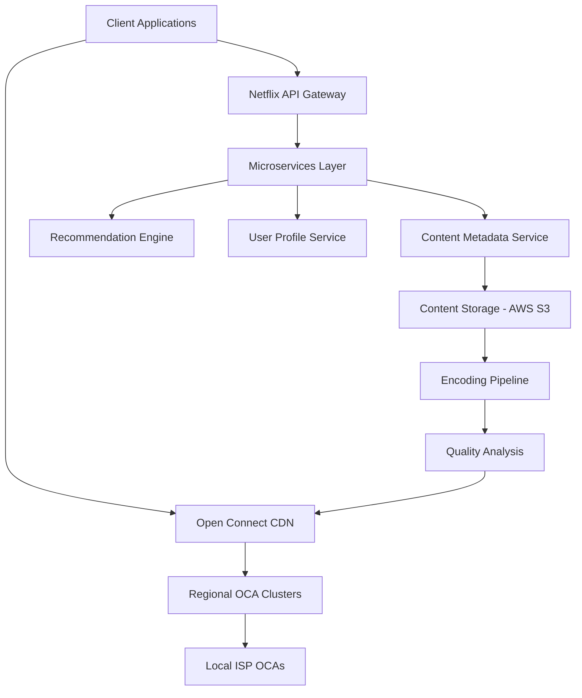

# Netflix Arxitekturası - Bölmə 5.1
## Məzmun Paylaşma və Video Yayım Texnologiyaları

### 📋 Mündəricat
1. [Ümumi Baxış](#ümumi-baxış)
2. [Məzmun Çatdırılma Şəbəkəsi (CDN)](#məzmun-çatdırılma-şəbəkəsi-cdn)
3. [Video Kodlaşdırma və Adaptiv Yayım](#video-kodlaşdırma-və-adaptiv-yayım)
4. [Open Connect Platforması](#open-connect-platforması)
5. [Yayım Protokolları](#yayım-protokolları)
6. [Keş Strategiyaları](#keş-strategiyaları)
7. [Performans Optimallaşdırması](#performans-optimallaşdırması)
8. [Texniki Arxitektura](#texniki-arxitektura)

---

## Ümumi Baxış

Netflix-in məzmun paylaşma və video yayım texnologiyaları dünyada ən böyük video yayım platformalarından birini dəstəkləyir. Bu sistem:

- **190+ ölkədə** xidmət göstərir
- **Günlük 1 milyard saatdan çox** video məzmunu yayımlayır
- **15+ Petabayt** məlumat ötürür
- **Milyonlarla istifadəçiyə** eyni zamanda xidmət göstərir

### 🎯 Əsas Məqsədlər
- Yüksək keyfiyyətli video yayımı
- Minimal gecikmə (latency)
- Qlobal miqyasda etibarlılıq
- Adaptiv məzmun çatdırılması

---

## Məzmun Çatdırılma Şəbəkəsi (CDN)

### Netflix Open Connect CDN

Netflix öz CDN sistemini - **Open Connect**-i inkişaf etdirib:

#### 🏗️ Arxitektura Komponentləri

```
┌─────────────────┐    ┌─────────────────┐    ┌─────────────────┐
│   İstifadəçi    │    │  Open Connect   │    │   Netflix       │
│   Cihazları     │◄──►│   Appliance     │◄──►│   Mərkəzi       │
│                 │    │     (OCA)       │    │   Serverlər     │
└─────────────────┘    └─────────────────┘    └─────────────────┘
```

#### 📍 Yerləşdirmə Strategiyası

1. **ISP Embedded Deployment**
   - İnternet Xidmət Provayderləri daxilində
   - Birbaşa istifadəçilərə yaxın
   - Minimal şəbəkə hopları

2. **Internet Exchange Point (IXP)**
   - Böyük internet mübadilə nöqtələrində
   - Çoxlu ISP-lərə xidmət
   - Regional məzmun paylaşımı

### 🔧 OCA Texniki Xüsusiyyətləri

| Komponent | Spesifikasiya |
|-----------|---------------|
| **Yaddaş** | 100TB+ SSD/HDD hibrid |
| **Şəbəkə** | 10/40/100 Gbps interfeyslər |
| **CPU** | Yüksək performanslı Intel Xeon |
| **OS** | FreeBSD əsaslı xüsusi sistem |

---

## Video Kodlaşdırma və Adaptiv Yayım

### 🎬 Video Kodlaşdırma Pipeline


#### Kodlaşdırma Formatları

1. **H.264 (AVC)**
   - Geniş cihaz dəstəyi
   - Stabil performans
   - Legacy cihazlar üçün

2. **H.265 (HEVC)**
   - 50% daha yaxşı sıxılma
   - 4K məzmun üçün optimal
   - Yeni cihazlar üçün

3. **VP9**
   - Google tərəfindən inkişaf
   - Açıq mənbə
   - Chrome brauzerləri üçün

4. **AV1**
   - Gələcəyin kodeki
   - Ən yaxşı sıxılma nisbəti
   - Tədricən tətbiq edilir

### 📊 Adaptiv Bitrate Streaming (ABS)

Netflix **Dynamic Adaptive Streaming over HTTP (DASH)** və **HTTP Live Streaming (HLS)** protokollarından istifadə edir:

#### Keyfiyyət Səviyyələri

| Rezolyusiya | Bitrate Aralığı | Hədəf Cihazlar |
|-------------|-----------------|-----------------|
| **240p** | 235 Kbps | Zəif internet |
| **360p** | 375-1000 Kbps | Mobil cihazlar |
| **480p** | 750-1750 Kbps | Standart TV |
| **720p** | 1900-4300 Kbps | HD TV |
| **1080p** | 3000-6000 Kbps | Full HD |
| **4K** | 15000-25000 Kbps | Ultra HD TV |

#### 🧠 Adaptiv Alqoritm

```python
# Sadələşdirilmiş adaptiv alqoritm nümunəsi
def select_bitrate(bandwidth, buffer_level, screen_size):
    if buffer_level < 5:  # Aşağı buffer
        return min_safe_bitrate(bandwidth * 0.8)
    elif buffer_level > 30:  # Yüksək buffer
        return optimal_bitrate(bandwidth, screen_size)
    else:
        return current_bitrate
```

---

## Open Connect Platforması

### 🌐 Qlobal Şəbəkə Topologiyası

Netflix Open Connect şəbəkəsi üç əsas komponentdən ibarətdir:

#### 1. Control Plane
- **OCM (Open Connect Management)**
- Server idarəetməsi
- Məzmun paylaşımı planlaması
- Performans monitorinqi

#### 2. Data Plane
- **OCA (Open Connect Appliance)**
- Video məzmunun saxlanması
- İstifadəçi sorğularına cavab
- Lokal keş idarəetməsi

#### 3. Routing Intelligence
- **BGP** əsaslı yönləndirmə
- İstifadəçiləri ən yaxın OCA-ya yönləndirmə
- Yük balanslaması

### 📈 Performans Metrikaları

```
┌─────────────────────────────────────────────────────────┐
│                Netflix CDN Performansı                 │
├─────────────────────────────────────────────────────────┤
│ Orta Gecikmə (Latency):        < 50ms                  │
│ Cache Hit Rate:                > 95%                   │
│ Video Start Time:              < 2 saniyə              │
│ Rebuffering Rate:              < 0.5%                  │
│ Throughput Efficiency:         > 90%                   │
└─────────────────────────────────────────────────────────┘
```

---

## Yayım Protokolları

### 🔄 HTTP-əsaslı Protokollar

#### 1. DASH (Dynamic Adaptive Streaming over HTTP)
```xml
<!-- DASH Manifest nümunəsi -->
<MPD xmlns="urn:mpeg:dash:schema:mpd:2011">
  <Period>
    <AdaptationSet mimeType="video/mp4">
      <Representation bandwidth="1000000" width="1280" height="720">
        <SegmentTemplate media="video_$Number$.m4s" 
                        initialization="video_init.m4s"/>
      </Representation>
    </AdaptationSet>
  </Period>
</MPD>
```

#### 2. HLS (HTTP Live Streaming)
```m3u8
#EXTM3U
#EXT-X-VERSION:3
#EXT-X-TARGETDURATION:10
#EXTINF:10.0,
segment001.ts
#EXTINF:10.0,
segment002.ts
```

### 🚀 Protokol Seçimi Strategiyası

| Platform | Əsas Protokol | Ehtiyat Protokol |
|----------|---------------|------------------|
| **Web Brauzerləri** | DASH | HLS |
| **iOS Cihazları** | HLS | DASH |
| **Android** | DASH | HLS |
| **Smart TV** | DASH/HLS | Cihaza görə |

---

## Keş Strategiyaları

### 💾 Çoxsəviyyəli Keş Arxitekturası

```
┌─────────────────────────────────────────────────────────┐
│                 Netflix Keş Iyerarxiyası               │
├─────────────────────────────────────────────────────────┤
│ L1: Cihaz Keşi (Client-side)                          │
│ L2: ISP Keşi (Open Connect Appliance)                 │
│ L3: Regional Keş (Regional OCA Clusters)              │
│ L4: Origin Servers (AWS S3 + CloudFront)              │
└─────────────────────────────────────────────────────────┘
```

#### 🎯 Keş Strategiyaları

1. **Popularity-based Caching**
   - Məşhur məzmun əvvəlcədən yüklənir
   - Regional baxış statistikalarına əsasən
   - Proaktiv məzmun yerləşdirmə

2. **Predictive Caching**
   - Maşın öyrənməsi alqoritmləri
   - İstifadəçi davranış təhlili
   - Gələcək tələblərin proqnozlaşdırılması

3. **Time-based Caching**
   - Yeni buraxılışlar üçün xüsusi strategiya
   - Peak saatlarda əlavə resurslar
   - Regional vaxt zonalarına uyğunlaşma

### 📊 Keş Effektivliyi

```python
# Keş performans hesablaması
cache_hit_ratio = cache_hits / (cache_hits + cache_misses)
bandwidth_savings = cache_hit_ratio * total_bandwidth
cost_savings = bandwidth_savings * cost_per_gb
```

---

## Performans Optimallaşdırması

### ⚡ Video Start Time Optimallaşdırması

#### 1. Manifest Optimallaşdırması
- Kiçik manifest faylları
- Sürətli parsing
- Minimal HTTP sorğuları

#### 2. Initial Segment Strategy
```javascript
// İlk seqmentin sürətli yüklənməsi
const initialSegmentSize = 2; // saniyə
const initialBitrate = Math.min(
    estimatedBandwidth * 0.8,
    maxSafeBitrate
);
```

#### 3. Parallel Loading
- Manifest və ilk seqmentin paralel yüklənməsi
- DNS prefetch
- Connection pooling

### 🔧 Şəbəkə Optimallaşdırması

#### TCP Optimallaşdırması
```bash
# TCP parametrlərinin optimallaşdırılması
net.core.rmem_max = 134217728
net.core.wmem_max = 134217728
net.ipv4.tcp_rmem = 4096 87380 134217728
net.ipv4.tcp_wmem = 4096 65536 134217728
```

#### HTTP/2 və HTTP/3 Dəstəyi
- Multiplexing imkanları
- Server Push texnologiyası
- QUIC protokolu dəstəyi

---

## Texniki Arxitektura

### 🏗️ Yüksək Səviyyəli Arxitektura



### 🔄 Məzmun Yayım Prosesi

1. **Content Ingestion**
   - Orijinal məzmunun qəbulu
   - Metadata ekstraktı
   - Keyfiyyət yoxlaması

2. **Encoding Pipeline**
   - Çoxlu format kodlaşdırması
   - Keyfiyyət optimallaşdırması
   - Thumbnail generasiyası

3. **Distribution**
   - OCA-lara məzmun paylaşımı
   - Regional prioritetləşdirmə
   - Yük balanslaması

4. **Delivery**
   - İstifadəçi sorğularına cavab
   - Adaptiv bitrate seçimi
   - Real-time performans monitorinqi

### 📈 Monitorinq və Analitika

#### Real-time Metrikalar
- **QoE (Quality of Experience)**
- **Rebuffering events**
- **Video start time**
- **Bitrate distribution**
- **Error rates**

#### Performans Dashboard
```json
{
  "global_metrics": {
    "concurrent_streams": 125000000,
    "total_bandwidth": "125 Tbps",
    "cache_hit_ratio": 0.96,
    "avg_start_time": "1.8s"
  },
  "regional_performance": {
    "north_america": {"qoe_score": 4.2},
    "europe": {"qoe_score": 4.1},
    "asia_pacific": {"qoe_score": 4.0}
  }
}
```

---

## 🚀 Gələcək İnnovasiyalar

### Planlaşdırılan Təkmilləşdirmələr

1. **8K Video Dəstəyi**
   - AV1 kodekinin genişləndirilməsi
   - Yeni sıxılma texnologiyaları
   - Ultra-yüksək keyfiyyət yayımı

2. **Edge Computing**
   - AI-powered content optimization
   - Real-time encoding at edge
   - Personalized content delivery

3. **5G Optimallaşdırması**
   - Ultra-low latency streaming
   - Mobile-first delivery strategies
   - Network slicing integration

### 🔬 Tədqiqat Sahələri

- **Perceptual Quality Optimization**
- **Machine Learning for CDN**
- **Immersive Content Delivery (VR/AR)**
- **Sustainable Streaming Technologies**

---

## 📚 Əlavə Resurslar

### Texniki Sənədlər
- [Netflix Tech Blog](https://netflixtechblog.com/)
- [Open Connect Specifications](https://openconnect.netflix.com/)
- [Netflix OSS Projects](https://netflix.github.io/)

### Akademik Tədqiqatlar
- "Netflix's Approach to Streaming Video at Scale"
- "Content Delivery Networks: A Global Perspective"
- "Adaptive Bitrate Streaming: Challenges and Solutions"

---

*Bu sənəd Netflix-in məzmun paylaşma və video yayım texnologiyalarının ətraflı təhlilini təqdim edir. Texnologiyalar sürətlə inkişaf etdiyi üçün məlumatlar müntəzəm yenilənir.* 