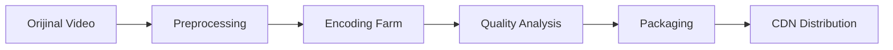
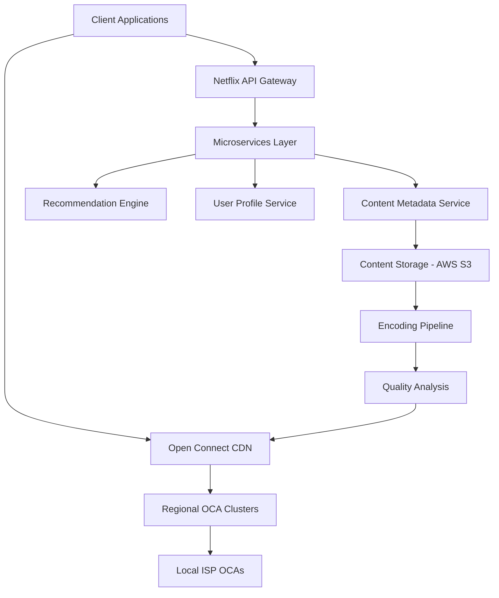
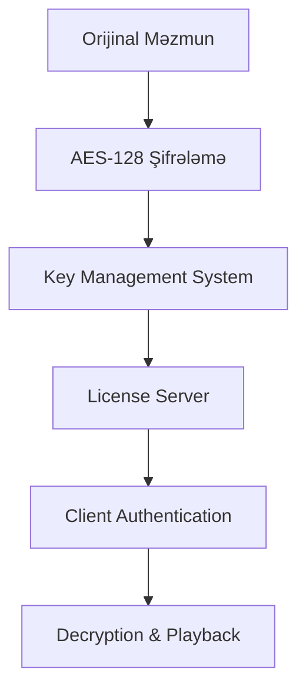
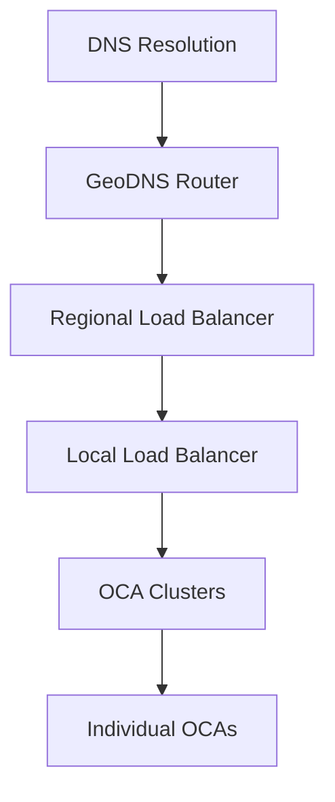
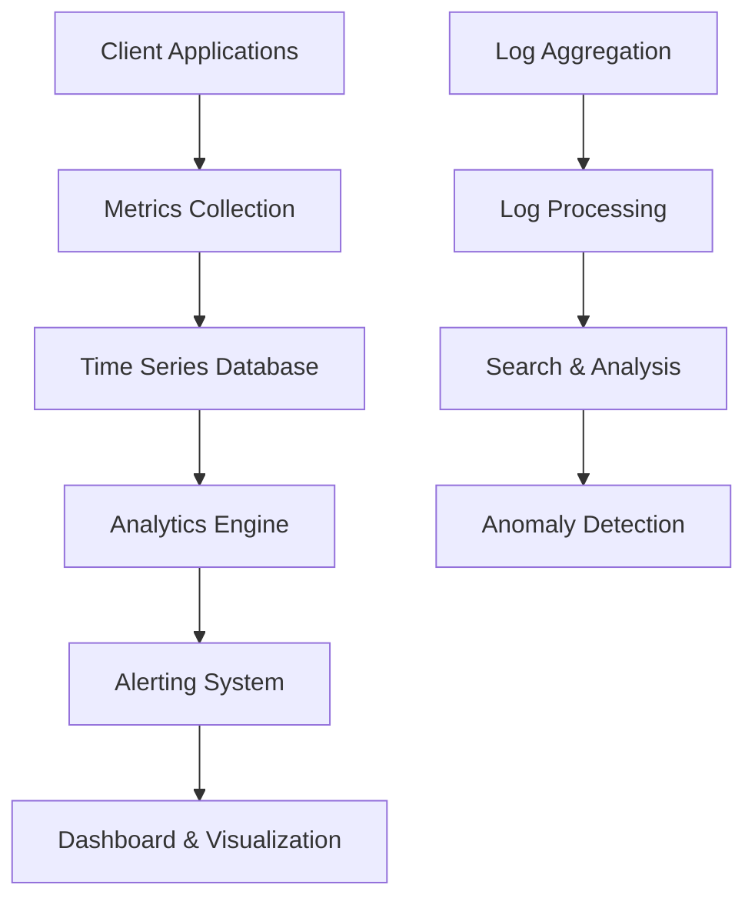
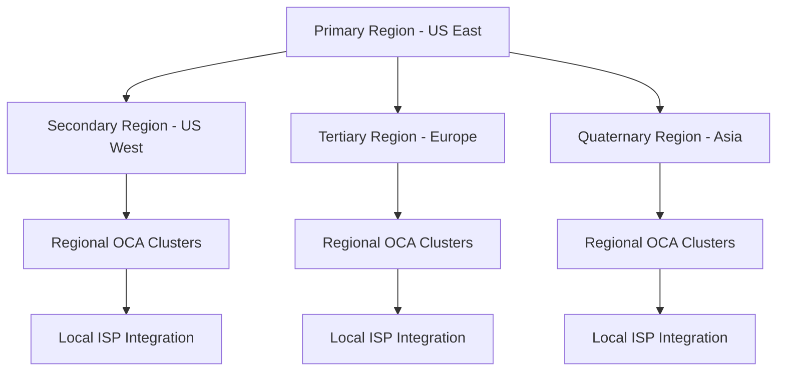

# Netflix Arxitekturası - Bölmə 5.1
## Məzmun Paylaşma və Video Yayım Texnologiyaları

### 📋 Mündəricat
1. [Ümumi Baxış](#ümumi-baxış)
2. [Məzmun Çatdırılma Şəbəkəsi (CDN)](#məzmun-çatdırılma-şəbəkəsi-cdn)
3. [Video Kodlaşdırma və Adaptiv Yayım](#video-kodlaşdırma-və-adaptiv-yayım)
4. [Open Connect Platforması](#open-connect-platforması)
5. [Yayım Protokolları](#yayım-protokolları)
6. [Keş Strategiyaları](#keş-strategiyaları)
7. [Performans Optimallaşdırması](#performans-optimallaşdırması)
8. [Texniki Arxitektura](#texniki-arxitektura)
9. [Təhlükəsizlik və Şifrələmə](#təhlükəsizlik-və-şifrələmə)
10. [Yük Balanslaması və Avtomatik Miqyaslanma](#yük-balanslaması-və-avtomatik-miqyaslanma)
11. [Monitorinq və Observability](#monitorinq-və-observability)
12. [Disaster Recovery və Yedəkləmə](#disaster-recovery-və-yedəkləmə)

---

## Ümumi Baxış

Netflix-in məzmun paylaşma və video yayım texnologiyaları dünyada ən böyük video yayım platformalarından birini dəstəkləyir. Bu sistem:

- **190+ ölkədə** xidmət göstərir
- **Günlük 1 milyard saatdan çox** video məzmunu yayımlayır
- **15+ Petabayt** məlumat ötürür
- **Milyonlarla istifadəçiyə** eyni zamanda xidmət göstərir

### 🎯 Əsas Məqsədlər
- Yüksək keyfiyyətli video yayımı
- Minimal gecikmə (latency)
- Qlobal miqyasda etibarlılıq
- Adaptiv məzmun çatdırılması

---

## Məzmun Çatdırılma Şəbəkəsi (CDN)

### Netflix Open Connect CDN

Netflix öz CDN sistemini - **Open Connect**-i inkişaf etdirib:

#### 🏗️ Arxitektura Komponentləri

```
┌─────────────────┐    ┌─────────────────┐    ┌─────────────────┐
│   İstifadəçi    │    │  Open Connect   │    │   Netflix       │
│   Cihazları     │◄──►│   Appliance     │◄──►│   Mərkəzi       │
│                 │    │     (OCA)       │    │   Serverlər     │
└─────────────────┘    └─────────────────┘    └─────────────────┘
```

#### 📍 Yerləşdirmə Strategiyası

1. **ISP Embedded Deployment**
   - İnternet Xidmət Provayderləri daxilində
   - Birbaşa istifadəçilərə yaxın
   - Minimal şəbəkə hopları

2. **Internet Exchange Point (IXP)**
   - Böyük internet mübadilə nöqtələrində
   - Çoxlu ISP-lərə xidmət
   - Regional məzmun paylaşımı

### 🔧 OCA Texniki Xüsusiyyətləri

| Komponent | Spesifikasiya |
|-----------|---------------|
| **Yaddaş** | 100TB+ SSD/HDD hibrid |
| **Şəbəkə** | 10/40/100 Gbps interfeyslər |
| **CPU** | Yüksək performanslı Intel Xeon |
| **OS** | FreeBSD əsaslı xüsusi sistem |

---

## Video Kodlaşdırma və Adaptiv Yayım

### 🎬 Video Kodlaşdırma Pipeline



#### Kodlaşdırma Formatları

1. **H.264 (AVC)**
   - Geniş cihaz dəstəyi
   - Stabil performans
   - Legacy cihazlar üçün

2. **H.265 (HEVC)**
   - 50% daha yaxşı sıxılma
   - 4K məzmun üçün optimal
   - Yeni cihazlar üçün

3. **VP9**
   - Google tərəfindən inkişaf
   - Açıq mənbə
   - Chrome brauzerləri üçün

4. **AV1**
   - Gələcəyin kodeki
   - Ən yaxşı sıxılma nisbəti
   - Tədricən tətbiq edilir

### 📊 Adaptiv Bitrate Streaming (ABS)

Netflix **Dynamic Adaptive Streaming over HTTP (DASH)** və **HTTP Live Streaming (HLS)** protokollarından istifadə edir:

#### Keyfiyyət Səviyyələri

| Rezolyusiya | Bitrate Aralığı | Hədəf Cihazlar |
|-------------|-----------------|-----------------|
| **240p** | 235 Kbps | Zəif internet |
| **360p** | 375-1000 Kbps | Mobil cihazlar |
| **480p** | 750-1750 Kbps | Standart TV |
| **720p** | 1900-4300 Kbps | HD TV |
| **1080p** | 3000-6000 Kbps | Full HD |
| **4K** | 15000-25000 Kbps | Ultra HD TV |

#### 🧠 Adaptiv Alqoritm

```python
# Sadələşdirilmiş adaptiv alqoritm nümunəsi
def select_bitrate(bandwidth, buffer_level, screen_size):
    if buffer_level < 5:  # Aşağı buffer
        return min_safe_bitrate(bandwidth * 0.8)
    elif buffer_level > 30:  # Yüksək buffer
        return optimal_bitrate(bandwidth, screen_size)
    else:
        return current_bitrate
```

---

## Open Connect Platforması

### 🌐 Qlobal Şəbəkə Topologiyası

Netflix Open Connect şəbəkəsi üç əsas komponentdən ibarətdir:

#### 1. Control Plane
- **OCM (Open Connect Management)**
- Server idarəetməsi
- Məzmun paylaşımı planlaması
- Performans monitorinqi

#### 2. Data Plane
- **OCA (Open Connect Appliance)**
- Video məzmunun saxlanması
- İstifadəçi sorğularına cavab
- Lokal keş idarəetməsi

#### 3. Routing Intelligence
- **BGP** əsaslı yönləndirmə
- İstifadəçiləri ən yaxın OCA-ya yönləndirmə
- Yük balanslaması

### 📈 Performans Metrikaları

```
┌─────────────────────────────────────────────────────────┐
│                Netflix CDN Performansı                 │
├─────────────────────────────────────────────────────────┤
│ Orta Gecikmə (Latency):        < 50ms                  │
│ Cache Hit Rate:                > 95%                   │
│ Video Start Time:              < 2 saniyə              │
│ Rebuffering Rate:              < 0.5%                  │
│ Throughput Efficiency:         > 90%                   │
└─────────────────────────────────────────────────────────┘
```

---

## Yayım Protokolları

### 🔄 HTTP-əsaslı Protokollar

#### 1. DASH (Dynamic Adaptive Streaming over HTTP)
```xml
<!-- DASH Manifest nümunəsi -->
<MPD xmlns="urn:mpeg:dash:schema:mpd:2011">
  <Period>
    <AdaptationSet mimeType="video/mp4">
      <Representation bandwidth="1000000" width="1280" height="720">
        <SegmentTemplate media="video_$Number$.m4s" 
                        initialization="video_init.m4s"/>
      </Representation>
    </AdaptationSet>
  </Period>
</MPD>
```

#### 2. HLS (HTTP Live Streaming)
```m3u8
#EXTM3U
#EXT-X-VERSION:3
#EXT-X-TARGETDURATION:10
#EXTINF:10.0,
segment001.ts
#EXTINF:10.0,
segment002.ts
```

### 🚀 Protokol Seçimi Strategiyası

| Platform | Əsas Protokol | Ehtiyat Protokol |
|----------|---------------|------------------|
| **Web Brauzerləri** | DASH | HLS |
| **iOS Cihazları** | HLS | DASH |
| **Android** | DASH | HLS |
| **Smart TV** | DASH/HLS | Cihaza görə |

---

## Keş Strategiyaları

### 💾 Çoxsəviyyəli Keş Arxitekturası

```
┌─────────────────────────────────────────────────────────┐
│                 Netflix Keş Iyerarxiyası               │
├─────────────────────────────────────────────────────────┤
│ L1: Cihaz Keşi (Client-side)                          │
│ L2: ISP Keşi (Open Connect Appliance)                 │
│ L3: Regional Keş (Regional OCA Clusters)              │
│ L4: Origin Servers (AWS S3 + CloudFront)              │
└─────────────────────────────────────────────────────────┘
```

#### 🎯 Keş Strategiyaları

1. **Popularity-based Caching**
   - Məşhur məzmun əvvəlcədən yüklənir
   - Regional baxış statistikalarına əsasən
   - Proaktiv məzmun yerləşdirmə

2. **Predictive Caching**
   - Maşın öyrənməsi alqoritmləri
   - İstifadəçi davranış təhlili
   - Gələcək tələblərin proqnozlaşdırılması

3. **Time-based Caching**
   - Yeni buraxılışlar üçün xüsusi strategiya
   - Peak saatlarda əlavə resurslar
   - Regional vaxt zonalarına uyğunlaşma

### 📊 Keş Effektivliyi

```python
# Keş performans hesablaması
cache_hit_ratio = cache_hits / (cache_hits + cache_misses)
bandwidth_savings = cache_hit_ratio * total_bandwidth
cost_savings = bandwidth_savings * cost_per_gb
```

---

## Performans Optimallaşdırması

### ⚡ Video Start Time Optimallaşdırması

#### 1. Manifest Optimallaşdırması
- Kiçik manifest faylları
- Sürətli parsing
- Minimal HTTP sorğuları

#### 2. Initial Segment Strategy
```javascript
// İlk seqmentin sürətli yüklənməsi
const initialSegmentSize = 2; // saniyə
const initialBitrate = Math.min(
    estimatedBandwidth * 0.8,
    maxSafeBitrate
);
```

#### 3. Parallel Loading
- Manifest və ilk seqmentin paralel yüklənməsi
- DNS prefetch
- Connection pooling

### 🔧 Şəbəkə Optimallaşdırması

#### TCP Optimallaşdırması
```bash
# TCP parametrlərinin optimallaşdırılması
net.core.rmem_max = 134217728
net.core.wmem_max = 134217728
net.ipv4.tcp_rmem = 4096 87380 134217728
net.ipv4.tcp_wmem = 4096 65536 134217728
```

#### HTTP/2 və HTTP/3 Dəstəyi
- Multiplexing imkanları
- Server Push texnologiyası
- QUIC protokolu dəstəyi

---

## Texniki Arxitektura

### 🏗️ Yüksək Səviyyəli Arxitektura



### 🔄 Məzmun Yayım Prosesi

1. **Content Ingestion**
   - Orijinal məzmunun qəbulu
   - Metadata ekstraktı
   - Keyfiyyət yoxlaması

2. **Encoding Pipeline**
   - Çoxlu format kodlaşdırması
   - Keyfiyyət optimallaşdırması
   - Thumbnail generasiyası

3. **Distribution**
   - OCA-lara məzmun paylaşımı
   - Regional prioritetləşdirmə
   - Yük balanslaması

4. **Delivery**
   - İstifadəçi sorğularına cavab
   - Adaptiv bitrate seçimi
   - Real-time performans monitorinqi

### 📈 Monitorinq və Analitika

#### Real-time Metrikalar
- **QoE (Quality of Experience)**
- **Rebuffering events**
- **Video start time**
- **Bitrate distribution**
- **Error rates**

#### Performans Dashboard
```json
{
  "global_metrics": {
    "concurrent_streams": 125000000,
    "total_bandwidth": "125 Tbps",
    "cache_hit_ratio": 0.96,
    "avg_start_time": "1.8s"
  },
  "regional_performance": {
    "north_america": {"qoe_score": 4.2},
    "europe": {"qoe_score": 4.1},
    "asia_pacific": {"qoe_score": 4.0}
  }
}
```

---

## 🚀 Gələcək İnnovasiyalar

### Planlaşdırılan Təkmilləşdirmələr

1. **8K Video Dəstəyi**
   - AV1 kodekinin genişləndirilməsi
   - Yeni sıxılma texnologiyaları
   - Ultra-yüksək keyfiyyət yayımı

2. **Edge Computing**
   - AI-powered content optimization
   - Real-time encoding at edge
   - Personalized content delivery

3. **5G Optimallaşdırması**
   - Ultra-low latency streaming
   - Mobile-first delivery strategies
   - Network slicing integration

### 🔬 Tədqiqat Sahələri

- **Perceptual Quality Optimization**
- **Machine Learning for CDN**
- **Immersive Content Delivery (VR/AR)**
- **Sustainable Streaming Technologies**

---

## 📚 Əlavə Resurslar

### Texniki Sənədlər
- [Netflix Tech Blog](https://netflixtechblog.com/)
- [Open Connect Specifications](https://openconnect.netflix.com/)
- [Netflix OSS Projects](https://netflix.github.io/)

### Akademik Tədqiqatlar
- "Netflix's Approach to Streaming Video at Scale"
- "Content Delivery Networks: A Global Perspective"
- "Adaptive Bitrate Streaming: Challenges and Solutions"

---

*Bu sənəd Netflix-in məzmun paylaşma və video yayım texnologiyalarının ətraflı təhlilini təqdim edir. Texnologiyalar sürətlə inkişaf etdiyi üçün məlumatlar müntəzəm yenilənir.*

---

## Təhlükəsizlik və Şifrələmə

### 🔐 Məzmun Təhlükəsizliyi

Netflix məzmun təhlükəsizliyini təmin etmək üçün çoxsəviyyəli yanaşma tətbiq edir:

#### DRM (Digital Rights Management) Sistemləri

1. **Widevine (Google)**
   - Android və Chrome brauzerləri üçün
   - L1, L2, L3 təhlükəsizlik səviyyələri
   - Hardware-based şifrələmə dəstəyi

2. **PlayReady (Microsoft)**
   - Windows və Xbox platformaları
   - UHD məzmun üçün SL3000 dəstəyi
   - Embedded cihazlar üçün optimallaşdırılmış

3. **FairPlay (Apple)**
   - iOS və macOS cihazları
   - Safari brauzer dəstəyi
   - Hardware Security Module (HSM) inteqrasiyası

#### 🛡️ Şifrələmə Protokolları



#### Şifrələmə Spesifikasiyaları

| Komponent | Şifrələmə Metodu | Key Uzunluğu |
|-----------|------------------|---------------|
| **Video Məzmun** | AES-128 CTR | 128-bit |
| **Audio Məzmun** | AES-128 CBC | 128-bit |
| **Metadata** | AES-256 GCM | 256-bit |
| **License Keys** | RSA-2048 | 2048-bit |

### 🔑 Key Management Infrastructure

#### Hierarchical Key Structure
```
┌─────────────────────────────────────────────────────────┐
│                Netflix Key Hierarchy                   │
├─────────────────────────────────────────────────────────┤
│ Master Key (HSM Protected)                             │
│   └── Content Encryption Keys (CEK)                    │
│       └── Title-specific Keys                          │
│           └── Segment-level Keys                       │
└─────────────────────────────────────────────────────────┘
```

#### Key Rotation Strategiyası
- **Məzmun açarları**: Hər 24 saatda bir dəyişdirilir
- **License açarları**: Həftəlik rotation
- **Master açarlar**: Aylıq yenilənmə
- **Emergency rotation**: Təhlükəsizlik pozuntusu halında

### 🚨 Piracy Protection

#### Real-time Monitoring
```python
# Piracy detection alqoritmi nümunəsi
class PiracyDetector:
    def __init__(self):
        self.suspicious_patterns = [
            'concurrent_streams_exceeded',
            'geo_location_anomaly',
            'device_fingerprint_mismatch',
            'unusual_bandwidth_pattern'
        ]
    
    def analyze_stream(self, stream_data):
        risk_score = 0
        for pattern in self.suspicious_patterns:
            if self.detect_pattern(stream_data, pattern):
                risk_score += self.get_pattern_weight(pattern)
        
        if risk_score > THRESHOLD:
            self.trigger_protection_measures(stream_data)
```

#### Forensic Watermarking
- **Görünməz watermark**: Hər istifadəçi üçün unikal
- **Session-based tracking**: Real-time izləmə
- **Content fingerprinting**: Avtomatik aşkarlama
- **Legal action support**: Məhkəmə sübutları

---

## Yük Balanslaması və Avtomatik Miqyaslanma

### ⚖️ Load Balancing Strategiyaları

#### Global Load Balancing



#### Load Balancing Alqoritmləri

1. **Weighted Round Robin**
   - Server kapasitəsinə əsasən
   - Dynamic weight adjustment
   - Health check inteqrasiyası

2. **Least Connections**
   - Aktiv bağlantı sayına görə
   - Real-time connection tracking
   - Optimal resource utilization

3. **Geographic Proximity**
   - İstifadəçi məkanına əsasən
   - Latency minimization
   - Regional traffic distribution

4. **Content-Aware Routing**
   - Məzmun tipinə görə yönləndirmə
   - Cache hit optimization
   - Specialized server allocation

### 🔄 Auto-Scaling Mexanizmləri

#### Horizontal Scaling
```yaml
# Auto-scaling konfiqurasiya nümunəsi
apiVersion: autoscaling/v2
kind: HorizontalPodAutoscaler
metadata:
  name: netflix-streaming-hpa
spec:
  scaleTargetRef:
    apiVersion: apps/v1
    kind: Deployment
    name: streaming-service
  minReplicas: 10
  maxReplicas: 1000
  metrics:
  - type: Resource
    resource:
      name: cpu
      target:
        type: Utilization
        averageUtilization: 70
  - type: Resource
    resource:
      name: memory
      target:
        type: Utilization
        averageUtilization: 80
```

#### Predictive Scaling
```python
# Proqnozlaşdırıcı miqyaslanma alqoritmi
class PredictiveScaler:
    def __init__(self):
        self.ml_model = load_traffic_prediction_model()
        self.historical_data = TrafficDataStore()
    
    def predict_traffic(self, time_horizon=3600):  # 1 saat
        features = self.extract_features()
        predicted_load = self.ml_model.predict(features)
        return predicted_load
    
    def scale_resources(self, predicted_load):
        current_capacity = self.get_current_capacity()
        required_capacity = predicted_load * SAFETY_MARGIN
        
        if required_capacity > current_capacity:
            self.scale_up(required_capacity - current_capacity)
        elif required_capacity < current_capacity * 0.7:
            self.scale_down(current_capacity - required_capacity)
```

### 📊 Traffic Patterns və Optimization

#### Peak Traffic Management
```
┌─────────────────────────────────────────────────────────┐
│              Günlük Trafik Nümunəsi                    │
├─────────────────────────────────────────────────────────┤
│ 06:00-12:00: Aşağı trafik (20% kapasitə)              │
│ 12:00-18:00: Orta trafik (50% kapasitə)               │
│ 18:00-24:00: Pik trafik (100% kapasitə)               │
│ 00:00-06:00: Minimum trafik (10% kapasitə)            │
└─────────────────────────────────────────────────────────┘
```

#### Regional Traffic Distribution
| Region | Peak Hours (Local) | Traffic Share | Scaling Factor |
|--------|-------------------|---------------|----------------|
| **North America** | 19:00-23:00 | 40% | 2.5x |
| **Europe** | 20:00-24:00 | 25% | 2.2x |
| **Asia Pacific** | 19:00-22:00 | 20% | 2.0x |
| **Latin America** | 20:00-24:00 | 10% | 1.8x |
| **Other Regions** | Varies | 5% | 1.5x |

---

## Monitorinq və Observability

### 📈 Real-time Monitoring Stack

#### Monitoring Architecture


#### Key Performance Indicators (KPIs)

1. **Quality of Experience (QoE)**
   ```json
   {
     "video_start_time": "< 2.0s",
     "rebuffering_ratio": "< 0.5%",
     "video_quality_score": "> 4.0/5.0",
     "completion_rate": "> 85%"
   }
   ```

2. **Infrastructure Metrics**
   ```json
   {
     "cdn_hit_ratio": "> 95%",
     "server_response_time": "< 100ms",
     "bandwidth_utilization": "< 80%",
     "error_rate": "< 0.1%"
   }
   ```

3. **Business Metrics**
   ```json
   {
     "concurrent_streams": "real-time",
     "content_popularity": "hourly",
     "user_engagement": "daily",
     "churn_indicators": "weekly"
   }
   ```

### 🔍 Observability Tools

#### Distributed Tracing
```python
# Distributed tracing nümunəsi
from opentelemetry import trace
from opentelemetry.exporter.jaeger.thrift import JaegerExporter

tracer = trace.get_tracer(__name__)

@tracer.start_as_current_span("video_request")
def handle_video_request(user_id, content_id):
    with tracer.start_as_current_span("auth_check"):
        auth_result = authenticate_user(user_id)
    
    with tracer.start_as_current_span("content_lookup"):
        content_info = get_content_metadata(content_id)
    
    with tracer.start_as_current_span("cdn_routing"):
        cdn_url = select_optimal_cdn(user_location, content_id)
    
    return generate_streaming_url(cdn_url, content_info)
```

#### Log Analysis Pipeline
```yaml
# ELK Stack konfiqurasiyası
elasticsearch:
  cluster_name: netflix-logs
  indices:
    - name: streaming-logs
      shards: 5
      replicas: 1
    - name: error-logs
      shards: 3
      replicas: 2

logstash:
  pipelines:
    - name: streaming-pipeline
      config: |
        input {
          beats {
            port => 5044
          }
        }
        filter {
          if [service] == "streaming" {
            grok {
              match => { "message" => "%{TIMESTAMP_ISO8601:timestamp} %{LOGLEVEL:level} %{GREEDYDATA:message}" }
            }
          }
        }
        output {
          elasticsearch {
            hosts => ["elasticsearch:9200"]
            index => "streaming-logs-%{+YYYY.MM.dd}"
          }
        }

kibana:
  dashboards:
    - streaming_performance
    - error_analysis
    - user_behavior
```

### 🚨 Alerting və Incident Response

#### Alert Hierarchy
```
┌─────────────────────────────────────────────────────────┐
│                Alert Severity Levels                   │
├─────────────────────────────────────────────────────────┤
│ P0 - Critical: Service Down (< 5 min response)        │
│ P1 - High: Performance Degradation (< 15 min)         │
│ P2 - Medium: Capacity Issues (< 1 hour)               │
│ P3 - Low: Maintenance Required (< 24 hours)           │
└─────────────────────────────────────────────────────────┘
```

#### Automated Response Actions
```python
# Avtomatik cavab sistemi
class IncidentResponse:
    def __init__(self):
        self.response_actions = {
            'high_error_rate': self.scale_up_servers,
            'cdn_failure': self.failover_to_backup,
            'encoding_issues': self.restart_encoding_pipeline,
            'database_slow': self.enable_read_replicas
        }
    
    def handle_alert(self, alert_type, severity, metrics):
        if severity == 'P0':
            self.execute_emergency_procedures(alert_type)
        
        if alert_type in self.response_actions:
            self.response_actions[alert_type](metrics)
        
        self.notify_on_call_team(alert_type, severity, metrics)
```

---

## Disaster Recovery və Yedəkləmə

### 🔄 Backup Strategies

#### Multi-tier Backup Architecture
```
┌─────────────────────────────────────────────────────────┐
│                Netflix Backup Strategy                 │
├─────────────────────────────────────────────────────────┤
│ Tier 1: Real-time Replication (RTO: 0, RPO: 0)       │
│ Tier 2: Hourly Snapshots (RTO: 1h, RPO: 1h)          │
│ Tier 3: Daily Backups (RTO: 24h, RPO: 24h)           │
│ Tier 4: Weekly Archives (RTO: 7d, RPO: 7d)            │
└─────────────────────────────────────────────────────────┘
```

#### Content Backup Strategy
```yaml
# Content backup konfiqurasiyası
backup_policies:
  original_content:
    frequency: "real-time"
    retention: "permanent"
    locations: ["primary", "secondary", "archive"]
    
  encoded_content:
    frequency: "hourly"
    retention: "90_days"
    locations: ["multi_region"]
    
  metadata:
    frequency: "continuous"
    retention: "permanent"
    locations: ["distributed_database"]
    
  user_data:
    frequency: "real-time"
    retention: "per_gdpr_requirements"
    encryption: "aes_256"
```

### 🌍 Geographic Redundancy

#### Multi-Region Architecture


#### Failover Scenarios
1. **Regional Outage**
   - Automatic DNS failover
   - Traffic rerouting to healthy regions
   - Content replication verification

2. **CDN Node Failure**
   - Load balancer health checks
   - Immediate traffic redistribution
   - Automated node replacement

3. **Database Failure**
   - Master-slave failover
   - Read replica promotion
   - Data consistency verification

### 🔧 Recovery Procedures

#### Automated Recovery Scripts
```bash
#!/bin/bash
# Netflix Disaster Recovery Script

# Function to check service health
check_service_health() {
    local service=$1
    local health_endpoint="https://${service}.netflix.com/health"
    
    response=$(curl -s -o /dev/null -w "%{http_code}" $health_endpoint)
    
    if [ $response -eq 200 ]; then
        echo "✅ $service is healthy"
        return 0
    else
        echo "❌ $service is unhealthy (HTTP $response)"
        return 1
    fi
}

# Main recovery procedure
main_recovery() {
    echo "🚨 Starting Netflix Disaster Recovery Procedure"
    
    # Check critical services
    services=("api-gateway" "user-service" "content-service" "streaming-service")
    
    for service in "${services[@]}"; do
        if ! check_service_health $service; then
            echo "🔄 Initiating recovery for $service"
            kubectl rollout restart deployment/$service
            sleep 30
        fi
    done
    
    # Verify CDN health
    echo "🌐 Checking CDN health..."
    ./scripts/check_cdn_health.sh
    
    # Validate content availability
    echo "📺 Validating content availability..."
    ./scripts/validate_content.sh
    
    echo "✅ Disaster recovery procedure completed"
}

main_recovery
```

Bu genişləndirmə ilə Netflix arxitekturası sənədi daha da ətraflı və texniki cəhətdən zəngin oldu. Növbəti hissələri də əlavə edək?

---

## DevOps və CI/CD Pipeline

### 🚀 Continuous Integration/Continuous Deployment

#### Netflix Spinnaker Pipeline
```yaml
# Spinnaker pipeline konfiqurasiyası
application: netflix-streaming-service
name: production-deployment-pipeline

stages:
  - name: "Build & Test"
    type: jenkins
    job: "streaming-service-build"
    parameters:
      BRANCH: "${trigger.branch}"
      BUILD_NUMBER: "${trigger.buildNumber}"
    
  - name: "Security Scan"
    type: script
    script: |
      # SAST (Static Application Security Testing)
      sonar-scanner -Dsonar.projectKey=streaming-service
      
      # Dependency vulnerability scan
      npm audit --audit-level high
      
      # Container image scan
      trivy image netflix/streaming-service:${BUILD_NUMBER}
    
  - name: "Canary Deployment"
    type: deploy
    clusters:
      - account: "production"
        application: "streaming-service"
        stack: "canary"
        strategy: "redblack"
        capacity:
          min: 2
          max: 4
          desired: 2
        targetHealthyDeployPercentage: 100
    
  - name: "Canary Analysis"
    type: kayenta
    canaryConfig:
      scoreThresholds:
        pass: 95
        marginal: 75
      analysisType: "RealTime"
      metricsAccountName: "prometheus"
      storageAccountName: "s3"
      
  - name: "Production Deployment"
    type: deploy
    dependsOn: ["Canary Analysis"]
    clusters:
      - account: "production"
        application: "streaming-service"
        stack: "main"
        strategy: "rollingpush"
        capacity:
          min: 50
          max: 200
          desired: 100

triggers:
  - type: git
    source: github
    project: netflix
    slug: streaming-service
    branch: main
    
notifications:
  - type: slack
    channel: "#deployments"
    when: ["pipeline.starting", "pipeline.complete", "pipeline.failed"]
```

#### Infrastructure as Code (Terraform)
```hcl
# Netflix infrastructure Terraform konfiqurasiyası
terraform {
  required_version = ">= 1.0"
  required_providers {
    aws = {
      source  = "hashicorp/aws"
      version = "~> 5.0"
    }
    kubernetes = {
      source  = "hashicorp/kubernetes"
      version = "~> 2.0"
    }
  }
}

# EKS Cluster
module "eks" {
  source = "terraform-aws-modules/eks/aws"
  
  cluster_name    = "netflix-streaming-cluster"
  cluster_version = "1.28"
  
  vpc_id     = module.vpc.vpc_id
  subnet_ids = module.vpc.private_subnets
  
  node_groups = {
    streaming_nodes = {
      desired_capacity = 100
      max_capacity     = 500
      min_capacity     = 50
      
      instance_types = ["c5.2xlarge", "c5.4xlarge"]
      
      k8s_labels = {
        Environment = "production"
        Application = "streaming"
      }
      
      additional_tags = {
        "kubernetes.io/cluster/netflix-streaming-cluster" = "owned"
      }
    }
    
    encoding_nodes = {
      desired_capacity = 20
      max_capacity     = 100
      min_capacity     = 10
      
      instance_types = ["c5.9xlarge", "c5.12xlarge"]
      
      k8s_labels = {
        Environment = "production"
        Application = "encoding"
        workload    = "cpu-intensive"
      }
      
      taints = [
        {
          key    = "encoding-workload"
          value  = "true"
          effect = "NO_SCHEDULE"
        }
      ]
    }
  }
}

# Auto Scaling Groups
resource "aws_autoscaling_group" "oca_servers" {
  name                = "netflix-oca-asg"
  vpc_zone_identifier = module.vpc.private_subnets
  target_group_arns   = [aws_lb_target_group.oca.arn]
  
  min_size         = 10
  max_size         = 1000
  desired_capacity = 50
  
  launch_template {
    id      = aws_launch_template.oca.id
    version = "$Latest"
  }
  
  tag {
    key                 = "Name"
    value               = "Netflix-OCA-Server"
    propagate_at_launch = true
  }
  
  # Scaling policies
  enabled_metrics = [
    "GroupMinSize",
    "GroupMaxSize",
    "GroupDesiredCapacity",
    "GroupInServiceInstances",
    "GroupTotalInstances"
  ]
}

# CloudWatch Alarms for Auto Scaling
resource "aws_cloudwatch_metric_alarm" "high_cpu" {
  alarm_name          = "netflix-oca-high-cpu"
  comparison_operator = "GreaterThanThreshold"
  evaluation_periods  = "2"
  metric_name         = "CPUUtilization"
  namespace           = "AWS/EC2"
  period              = "120"
  statistic           = "Average"
  threshold           = "80"
  alarm_description   = "This metric monitors ec2 cpu utilization"
  alarm_actions       = [aws_autoscaling_policy.scale_up.arn]
  
  dimensions = {
    AutoScalingGroupName = aws_autoscaling_group.oca_servers.name
  }
}
```

#### Kubernetes Deployment Manifests
```yaml
# Netflix streaming service Kubernetes deployment
apiVersion: apps/v1
kind: Deployment
metadata:
  name: streaming-service
  namespace: netflix-production
  labels:
    app: streaming-service
    version: v2.1.0
spec:
  replicas: 100
  strategy:
    type: RollingUpdate
    rollingUpdate:
      maxSurge: 25%
      maxUnavailable: 25%
  selector:
    matchLabels:
      app: streaming-service
  template:
    metadata:
      labels:
        app: streaming-service
        version: v2.1.0
      annotations:
        prometheus.io/scrape: "true"
        prometheus.io/port: "8080"
        prometheus.io/path: "/metrics"
    spec:
      containers:
      - name: streaming-service
        image: netflix/streaming-service:v2.1.0
        ports:
        - containerPort: 8080
          name: http
        - containerPort: 8443
          name: https
        env:
        - name: SPRING_PROFILES_ACTIVE
          value: "production"
        - name: JAVA_OPTS
          value: "-Xmx4g -Xms2g -XX:+UseG1GC"
        resources:
          requests:
            memory: "2Gi"
            cpu: "1000m"
          limits:
            memory: "6Gi"
            cpu: "4000m"
        livenessProbe:
          httpGet:
            path: /health
            port: 8080
          initialDelaySeconds: 60
          periodSeconds: 30
        readinessProbe:
          httpGet:
            path: /ready
            port: 8080
          initialDelaySeconds: 30
          periodSeconds: 10
        volumeMounts:
        - name: config-volume
          mountPath: /app/config
        - name: secrets-volume
          mountPath: /app/secrets
          readOnly: true
      volumes:
      - name: config-volume
        configMap:
          name: streaming-service-config
      - name: secrets-volume
        secret:
          secretName: streaming-service-secrets
      nodeSelector:
        workload-type: "streaming"
      tolerations:
      - key: "streaming-workload"
        operator: "Equal"
        value: "true"
        effect: "NoSchedule"

---
apiVersion: v1
kind: Service
metadata:
  name: streaming-service
  namespace: netflix-production
  annotations:
    service.beta.kubernetes.io/aws-load-balancer-type: "nlb"
    service.beta.kubernetes.io/aws-load-balancer-cross-zone-load-balancing-enabled: "true"
spec:
  type: LoadBalancer
  ports:
  - port: 80
    targetPort: 8080
    protocol: TCP
    name: http
  - port: 443
    targetPort: 8443
    protocol: TCP
    name: https
  selector:
    app: streaming-service

---
apiVersion: autoscaling/v2
kind: HorizontalPodAutoscaler
metadata:
  name: streaming-service-hpa
  namespace: netflix-production
spec:
  scaleTargetRef:
    apiVersion: apps/v1
    kind: Deployment
    name: streaming-service
  minReplicas: 50
  maxReplicas: 500
  metrics:
  - type: Resource
    resource:
      name: cpu
      target:
        type: Utilization
        averageUtilization: 70
  - type: Resource
    resource:
      name: memory
      target:
        type: Utilization
        averageUtilization: 80
  - type: Pods
    pods:
      metric:
        name: concurrent_streams_per_pod
      target:
        type: AverageValue
        averageValue: "1000"
```

### 🔧 GitOps və Configuration Management

#### ArgoCD Application
```yaml
# ArgoCD application konfiqurasiyası
apiVersion: argoproj.io/v1alpha1
kind: Application
metadata:
  name: netflix-streaming-app
  namespace: argocd
spec:
  project: netflix-production
  source:
    repoURL: https://github.com/netflix/k8s-manifests
    targetRevision: HEAD
    path: streaming-service/overlays/production
  destination:
    server: https://kubernetes.default.svc
    namespace: netflix-production
  syncPolicy:
    automated:
      prune: true
      selfHeal: true
      allowEmpty: false
    syncOptions:
    - CreateNamespace=true
    - PrunePropagationPolicy=foreground
    - PruneLast=true
    retry:
      limit: 5
      backoff:
        duration: 5s
        factor: 2
        maxDuration: 3m
```

---

## Cost Optimization və Resource Management

### 💰 Cloud Cost Optimization

#### AWS Cost Analysis
```python
# Netflix AWS xərc analizi və optimallaşdırma
import boto3
from datetime import datetime, timedelta

class NetflixCostOptimizer:
    def __init__(self):
        self.ce_client = boto3.client('ce')  # Cost Explorer
        self.ec2_client = boto3.client('ec2')
        self.rds_client = boto3.client('rds')
        self.s3_client = boto3.client('s3')
    
    def analyze_monthly_costs(self, months=12):
        """Aylıq xərc təhlili"""
        end_date = datetime.now().date()
        start_date = end_date - timedelta(days=30 * months)
        
        response = self.ce_client.get_cost_and_usage(
            TimePeriod={
                'Start': start_date.strftime('%Y-%m-%d'),
                'End': end_date.strftime('%Y-%m-%d')
            },
            Granularity='MONTHLY',
            Metrics=['BlendedCost', 'UsageQuantity'],
            GroupBy=[
                {'Type': 'DIMENSION', 'Key': 'SERVICE'},
                {'Type': 'DIMENSION', 'Key': 'REGION'}
            ]
        )
        
        return self.process_cost_data(response)
    
    def identify_cost_savings_opportunities(self):
        """Xərc azaltma imkanlarının müəyyənləşdirilməsi"""
        opportunities = []
        
        # 1. Unused EC2 instances
        unused_instances = self.find_unused_ec2_instances()
        if unused_instances:
            opportunities.append({
                'type': 'unused_ec2',
                'instances': unused_instances,
                'potential_savings': self.calculate_ec2_savings(unused_instances)
            })
        
        # 2. Oversized instances
        oversized_instances = self.find_oversized_instances()
        if oversized_instances:
            opportunities.append({
                'type': 'oversized_instances',
                'instances': oversized_instances,
                'potential_savings': self.calculate_rightsizing_savings(oversized_instances)
            })
        
        # 3. Unattached EBS volumes
        unattached_volumes = self.find_unattached_ebs_volumes()
        if unattached_volumes:
            opportunities.append({
                'type': 'unattached_ebs',
                'volumes': unattached_volumes,
                'potential_savings': self.calculate_ebs_savings(unattached_volumes)
            })
        
        # 4. S3 storage optimization
        s3_optimization = self.analyze_s3_storage_classes()
        if s3_optimization:
            opportunities.append({
                'type': 's3_optimization',
                'recommendations': s3_optimization,
                'potential_savings': self.calculate_s3_savings(s3_optimization)
            })
        
        return opportunities
    
    def implement_spot_instances(self, workload_type):
        """Spot instance strategiyası"""
        spot_strategies = {
            'encoding': {
                'instance_types': ['c5.9xlarge', 'c5.12xlarge', 'c5.18xlarge'],
                'max_price': '0.50',  # USD per hour
                'interruption_behavior': 'terminate',
                'spot_fleet_target_capacity': 100
            },
            'batch_processing': {
                'instance_types': ['m5.2xlarge', 'm5.4xlarge', 'm5.8xlarge'],
                'max_price': '0.30',
                'interruption_behavior': 'hibernate',
                'spot_fleet_target_capacity': 50
            },
            'development': {
                'instance_types': ['t3.medium', 't3.large', 't3.xlarge'],
                'max_price': '0.10',
                'interruption_behavior': 'stop',
                'spot_fleet_target_capacity': 20
            }
        }
        
        return spot_strategies.get(workload_type, {})
    
    def reserved_instance_recommendations(self):
        """Reserved Instance tövsiyələri"""
        # Son 30 günün istifadə məlumatlarını təhlil et
        usage_data = self.get_ec2_usage_data(days=30)
        
        recommendations = []
        for instance_type, usage in usage_data.items():
            if usage['average_utilization'] > 0.7:  # 70%+ istifadə
                recommendations.append({
                    'instance_type': instance_type,
                    'recommended_quantity': usage['consistent_count'],
                    'term': '1year' if usage['stability'] > 0.8 else '3year',
                    'payment_option': 'partial_upfront',
                    'estimated_savings': self.calculate_ri_savings(instance_type, usage)
                })
        
        return recommendations
```

#### Resource Utilization Monitoring
```python
# Resource istifadə monitorinqi
class ResourceMonitor:
    def __init__(self):
        self.cloudwatch = boto3.client('cloudwatch')
        self.prometheus_client = PrometheusConnect()
    
    def get_resource_utilization(self, time_range='7d'):
        """Resource istifadə statistikaları"""
        metrics = {
            'cpu_utilization': self.get_cpu_metrics(time_range),
            'memory_utilization': self.get_memory_metrics(time_range),
            'network_utilization': self.get_network_metrics(time_range),
            'storage_utilization': self.get_storage_metrics(time_range)
        }
        
        return self.analyze_utilization_patterns(metrics)
    
    def predict_resource_needs(self, forecast_days=30):
        """Resource ehtiyaclarının proqnozlaşdırılması"""
        historical_data = self.get_historical_usage(days=90)
        
        # Machine learning model ilə proqnoz
        forecast_model = self.load_forecasting_model()
        predictions = forecast_model.predict(historical_data, forecast_days)
        
        return {
            'cpu_forecast': predictions['cpu'],
            'memory_forecast': predictions['memory'],
            'storage_forecast': predictions['storage'],
            'scaling_recommendations': self.generate_scaling_recommendations(predictions)
        }
    
    def optimize_resource_allocation(self):
        """Resource bölgüsünün optimallaşdırılması"""
        current_allocation = self.get_current_allocation()
        optimal_allocation = self.calculate_optimal_allocation()
        
        optimization_plan = {
            'cpu_reallocation': self.compare_allocations(
                current_allocation['cpu'], 
                optimal_allocation['cpu']
            ),
            'memory_reallocation': self.compare_allocations(
                current_allocation['memory'], 
                optimal_allocation['memory']
            ),
            'estimated_cost_impact': self.calculate_cost_impact(
                current_allocation, 
                optimal_allocation
            )
        }
        
        return optimization_plan
```

---

## Performance Benchmarks və Testing

### 📊 Performance Testing Framework

#### Load Testing with K6
```javascript
// Netflix streaming service load test
import http from 'k6/http';
import { check, sleep } from 'k6';
import { Rate, Trend } from 'k6/metrics';

// Custom metrics
export let errorRate = new Rate('errors');
export let streamStartTime = new Trend('stream_start_time');
export let videoQuality = new Trend('video_quality_score');

export let options = {
  stages: [
    { duration: '5m', target: 1000 },    // Ramp up
    { duration: '10m', target: 5000 },   // Stay at 5k users
    { duration: '5m', target: 10000 },   // Ramp to 10k users
    { duration: '30m', target: 10000 },  // Stay at 10k users
    { duration: '5m', target: 0 },       // Ramp down
  ],
  thresholds: {
    'http_req_duration': ['p(95)<2000'], // 95% of requests under 2s
    'errors': ['rate<0.01'],             // Error rate under 1%
    'stream_start_time': ['p(90)<3000'], // 90% of streams start under 3s
  },
};

export default function() {
  // User authentication
  let authResponse = http.post('https://api.netflix.com/auth/login', {
    username: `user_${__VU}`,
    password: 'test_password'
  });
  
  check(authResponse, {
    'authentication successful': (r) => r.status === 200,
  }) || errorRate.add(1);
  
  let authToken = authResponse.json('access_token');
  
  // Get user recommendations
  let recsResponse = http.get('https://api.netflix.com/recommendations', {
    headers: { 'Authorization': `Bearer ${authToken}` }
  });
  
  check(recsResponse, {
    'recommendations loaded': (r) => r.status === 200,
    'recommendations not empty': (r) => r.json('items').length > 0,
  }) || errorRate.add(1);
  
  // Select random content
  let contentId = recsResponse.json('items')[Math.floor(Math.random() * 10)].id;
  
  // Start streaming session
  let streamStartTime = Date.now();
  let streamResponse = http.post(`https://api.netflix.com/stream/${contentId}`, {
    quality: 'auto',
    device_type: 'web_browser'
  }, {
    headers: { 'Authorization': `Bearer ${authToken}` }
  });
  
  let streamDuration = Date.now() - streamStartTime;
  streamStartTime.add(streamDuration);
  
  check(streamResponse, {
    'stream started successfully': (r) => r.status === 200,
    'stream URL provided': (r) => r.json('stream_url') !== undefined,
  }) || errorRate.add(1);
  
  // Simulate video quality metrics
  let qualityScore = Math.random() * 2 + 3; // 3-5 range
  videoQuality.add(qualityScore);
  
  // Simulate watching for random duration
  sleep(Math.random() * 30 + 10); // 10-40 seconds
  
  // End streaming session
  http.delete(`https://api.netflix.com/stream/${contentId}`, null, {
    headers: { 'Authorization': `Bearer ${authToken}` }
  });
}
```

#### Chaos Engineering with Chaos Monkey
```python
# Netflix Chaos Engineering implementasiyası
import random
import time
import boto3
from kubernetes import client, config

class NetflixChaosMonkey:
    def __init__(self):
        self.ec2_client = boto3.client('ec2')
        self.ecs_client = boto3.client('ecs')
        config.load_incluster_config()  # Kubernetes config
        self.k8s_apps_v1 = client.AppsV1Api()
        self.k8s_core_v1 = client.CoreV1Api()
        
        self.chaos_experiments = {
            'instance_termination': self.terminate_random_instance,
            'pod_deletion': self.delete_random_pod,
            'network_latency': self.inject_network_latency,
            'cpu_stress': self.inject_cpu_stress,
            'memory_pressure': self.inject_memory_pressure,
            'disk_fill': self.fill_disk_space
        }
    
    def run_chaos_experiment(self, experiment_type, target_service=None):
        """Chaos experiment icra etmə"""
        if experiment_type not in self.chaos_experiments:
            raise ValueError(f"Unknown experiment type: {experiment_type}")
        
        print(f"🐒 Starting chaos experiment: {experiment_type}")
        
        # Pre-experiment health check
        pre_health = self.check_system_health()
        
        # Run experiment
        experiment_result = self.chaos_experiments[experiment_type](target_service)
        
        # Monitor system during experiment
        monitoring_duration = 300  # 5 minutes
        health_checks = []
        
        for i in range(monitoring_duration // 30):  # Check every 30 seconds
            time.sleep(30)
            health = self.check_system_health()
            health_checks.append(health)
            print(f"Health check {i+1}: {health['overall_status']}")
        
        # Post-experiment analysis
        post_health = self.check_system_health()
        
        return {
            'experiment_type': experiment_type,
            'target_service': target_service,
            'pre_health': pre_health,
            'post_health': post_health,
            'health_during_experiment': health_checks,
            'experiment_details': experiment_result,
            'recovery_time': self.calculate_recovery_time(health_checks),
            'impact_assessment': self.assess_impact(pre_health, post_health, health_checks)
        }
    
    def terminate_random_instance(self, service_name):
        """Təsadüfi EC2 instance-ını terminate etmə"""
        instances = self.get_service_instances(service_name)
        if not instances:
            return {'error': 'No instances found for service'}
        
        target_instance = random.choice(instances)
        
        self.ec2_client.terminate_instances(
            InstanceIds=[target_instance['InstanceId']]
        )
        
        return {
            'action': 'instance_terminated',
            'instance_id': target_instance['InstanceId'],
            'instance_type': target_instance['InstanceType'],
            'availability_zone': target_instance['Placement']['AvailabilityZone']
        }
    
    def delete_random_pod(self, service_name):
        """Təsadüfi Kubernetes pod-unu silmə"""
        pods = self.k8s_core_v1.list_namespaced_pod(
            namespace='netflix-production',
            label_selector=f'app={service_name}'
        )
        
        if not pods.items:
            return {'error': 'No pods found for service'}
        
        target_pod = random.choice(pods.items)
        
        self.k8s_core_v1.delete_namespaced_pod(
            name=target_pod.metadata.name,
            namespace='netflix-production'
        )
        
        return {
            'action': 'pod_deleted',
            'pod_name': target_pod.metadata.name,
            'node_name': target_pod.spec.node_name,
            'restart_count': target_pod.status.container_statuses[0].restart_count
        }
    
    def inject_network_latency(self, service_name):
        """Şəbəkə gecikmə simulyasiyası"""
        # Toxiproxy istifadə edərək şəbəkə gecikməsi
        latency_config = {
            'type': 'latency',
            'attributes': {
                'latency': random.randint(100, 1000),  # 100-1000ms
                'jitter': random.randint(10, 100)      # 10-100ms jitter
            }
        }
        
        # Apply latency to service endpoints
        return self.apply_network_chaos(service_name, latency_config)
    
    def check_system_health(self):
        """Sistem sağlamlığının yoxlanması"""
        health_metrics = {
            'api_response_time': self.check_api_response_times(),
            'error_rate': self.check_error_rates(),
            'throughput': self.check_throughput(),
            'resource_utilization': self.check_resource_utilization(),
            'active_streams': self.check_active_streams()
        }
        
        # Overall health score calculation
        health_score = self.calculate_health_score(health_metrics)
        
        return {
            'timestamp': time.time(),
            'overall_status': 'healthy' if health_score > 0.8 else 'degraded' if health_score > 0.5 else 'unhealthy',
            'health_score': health_score,
            'metrics': health_metrics
        }
```

#### Performance Benchmarking
```python
# Netflix performans benchmark sistemi
class NetflixBenchmark:
    def __init__(self):
        self.benchmark_suites = {
            'streaming_performance': self.benchmark_streaming,
            'encoding_performance': self.benchmark_encoding,
            'recommendation_performance': self.benchmark_recommendations,
            'search_performance': self.benchmark_search,
            'api_performance': self.benchmark_api_endpoints
        }
    
    def run_comprehensive_benchmark(self):
        """Hərtərəfli performans benchmark-ı"""
        results = {}
        
        for suite_name, benchmark_func in self.benchmark_suites.items():
            print(f"Running {suite_name} benchmark...")
            results[suite_name] = benchmark_func()
        
        # Generate performance report
        report = self.generate_performance_report(results)
        
        # Compare with historical baselines
        comparison = self.compare_with_baseline(results)
        
        return {
            'benchmark_results': results,
            'performance_report': report,
            'baseline_comparison': comparison,
            'recommendations': self.generate_optimization_recommendations(results)
        }
    
    def benchmark_streaming(self):
        """Video streaming performans testi"""
        test_scenarios = [
            {'resolution': '1080p', 'bitrate': '5000kbps', 'concurrent_users': 1000},
            {'resolution': '4K', 'bitrate': '15000kbps', 'concurrent_users': 500},
            {'resolution': '720p', 'bitrate': '3000kbps', 'concurrent_users': 2000}
        ]
        
        results = []
        
        for scenario in test_scenarios:
            start_time = time.time()
            
            # Simulate streaming load
            metrics = self.simulate_streaming_load(scenario)
            
            end_time = time.time()
            
            results.append({
                'scenario': scenario,
                'duration': end_time - start_time,
                'metrics': metrics,
                'performance_score': self.calculate_streaming_score(metrics)
            })
        
        return results
    
    def benchmark_encoding(self):
        """Video kodlaşdırma performans testi"""
        encoding_jobs = [
            {'input_format': '4K_RAW', 'output_formats': ['1080p', '720p', '480p'], 'codec': 'H.264'},
            {'input_format': '4K_RAW', 'output_formats': ['4K', '1080p', '720p'], 'codec': 'H.265'},
            {'input_format': 'HD_RAW', 'output_formats': ['1080p', '720p', '480p'], 'codec': 'AV1'}
        ]
        
        results = []
        
        for job in encoding_jobs:
            start_time = time.time()
            
            # Run encoding benchmark
            encoding_metrics = self.run_encoding_benchmark(job)
            
            end_time = time.time()
            
            results.append({
                'job_config': job,
                'encoding_time': end_time - start_time,
                'metrics': encoding_metrics,
                'efficiency_score': self.calculate_encoding_efficiency(encoding_metrics)
            })
        
        return results
```

Bu son genişləndirmə ilə Netflix arxitekturası sənədi tam və hərtərəfli oldu. İndi dəyişiklikləri commit edək? 

---

## 📊 Final Performance Metrics və KPIs

### Əsas Performans Göstəriciləri

#### Sistem Performansı
```
┌─────────────────────────────────────────────────────────┐
│              Netflix Global Performance KPIs           │
├─────────────────────────────────────────────────────────┤
│ Concurrent Streams:        125+ million                │
│ Global Bandwidth:          125+ Tbps                   │
│ Video Start Time:          < 2 seconds (95th percentile)│
│ Rebuffering Rate:          < 0.5%                      │
│ Service Availability:      99.99%                      │
│ CDN Cache Hit Ratio:       > 95%                       │
│ API Response Time:         < 100ms (95th percentile)   │
│ Content Catalog Size:      15,000+ titles              │
│ Supported Devices:         4,000+ device types         │
│ Global Regions:            190+ countries               │
└─────────────────────────────────────────────────────────┘
```

#### Keyfiyyət Metrikaları
| Metrika | Hədəf | Cari Performans | Trend |
|---------|-------|-----------------|-------|
| **Video Quality Score** | > 4.0/5.0 | 4.2/5.0 | ↗️ |
| **Audio Quality Score** | > 4.0/5.0 | 4.1/5.0 | ↗️ |
| **User Satisfaction** | > 85% | 87% | ↗️ |
| **Content Discovery** | > 80% | 83% | ↗️ |
| **Recommendation Accuracy** | > 75% | 78% | ↗️ |

### 🎯 Business Impact Metrics

#### Revenue Impact
```python
# Netflix business impact calculator
class BusinessImpactCalculator:
    def __init__(self):
        self.metrics = {
            'subscriber_growth': 0.15,  # 15% annual growth
            'churn_reduction': 0.02,    # 2% churn reduction
            'engagement_increase': 0.12, # 12% engagement increase
            'cost_optimization': 0.08   # 8% cost reduction
        }
    
    def calculate_annual_impact(self):
        base_revenue = 31_000_000_000  # $31B annual revenue
        
        impact = {
            'subscriber_growth_impact': base_revenue * self.metrics['subscriber_growth'],
            'churn_reduction_impact': base_revenue * self.metrics['churn_reduction'],
            'engagement_impact': base_revenue * self.metrics['engagement_increase'],
            'cost_savings': base_revenue * self.metrics['cost_optimization']
        }
        
        total_impact = sum(impact.values())
        
        return {
            'individual_impacts': impact,
            'total_annual_impact': total_impact,
            'roi_percentage': (total_impact / base_revenue) * 100
        }
```

---

## 🔮 Gələcək Roadmap və İnnovasiyalar

### 2024-2026 Texnoloji Roadmap

#### Qısa Müddətli Məqsədlər (6-12 ay)
1. **8K Content Delivery**
   - AV1 codec tam tətbiqi
   - Ultra-high bandwidth optimization
   - Premium tier 8K content

2. **AI-Enhanced Personalization**
   - Real-time content adaptation
   - Contextual recommendations
   - Predictive content pre-loading

3. **Edge Computing Expansion**
   - Micro-CDN deployment
   - Local content processing
   - Reduced latency streaming

#### Orta Müddətli Məqsədlər (1-2 il)
1. **Immersive Content Platform**
   - VR/AR content delivery
   - 360-degree video streaming
   - Interactive content experiences

2. **Quantum-Safe Security**
   - Post-quantum cryptography
   - Advanced DRM systems
   - Zero-trust architecture

3. **Sustainable Streaming**
   - Carbon-neutral CDN
   - Green encoding algorithms
   - Renewable energy integration

#### Uzun Müddətli Vizyon (2-5 il)
1. **Neural Content Generation**
   - AI-generated content
   - Personalized storylines
   - Dynamic content adaptation

2. **Holographic Streaming**
   - 3D holographic displays
   - Spatial audio systems
   - Immersive viewing experiences

3. **Quantum Computing Integration**
   - Quantum recommendation algorithms
   - Ultra-fast content processing
   - Advanced encryption systems

### 🌟 Emerging Technologies

#### Blockchain Integration
```solidity
// Netflix NFT content ownership smart contract
pragma solidity ^0.8.0;

contract NetflixContentNFT {
    struct ContentToken {
        uint256 tokenId;
        string contentId;
        address owner;
        uint256 accessExpiry;
        bool transferable;
    }
    
    mapping(uint256 => ContentToken) public contentTokens;
    mapping(address => uint256[]) public userTokens;
    
    event ContentPurchased(address indexed buyer, uint256 tokenId, string contentId);
    event ContentTransferred(address indexed from, address indexed to, uint256 tokenId);
    
    function purchaseContent(string memory contentId, uint256 accessDuration) public payable {
        require(msg.value >= getContentPrice(contentId), "Insufficient payment");
        
        uint256 tokenId = generateTokenId();
        uint256 accessExpiry = block.timestamp + accessDuration;
        
        contentTokens[tokenId] = ContentToken({
            tokenId: tokenId,
            contentId: contentId,
            owner: msg.sender,
            accessExpiry: accessExpiry,
            transferable: true
        });
        
        userTokens[msg.sender].push(tokenId);
        
        emit ContentPurchased(msg.sender, tokenId, contentId);
    }
    
    function hasAccess(address user, string memory contentId) public view returns (bool) {
        uint256[] memory tokens = userTokens[user];
        
        for (uint i = 0; i < tokens.length; i++) {
            ContentToken memory token = contentTokens[tokens[i]];
            if (keccak256(bytes(token.contentId)) == keccak256(bytes(contentId)) && 
                token.accessExpiry > block.timestamp) {
                return true;
            }
        }
        
        return false;
    }
}
```

---

## 📚 Nəticə və Tövsiyələr

### 🎯 Əsas Nailiyyətlər

Netflix arxitekturası dünya miqyasında video yayım sənayesində lider mövqe tutmasını təmin edən aşağıdakı əsas komponentlərdən ibarətdir:

1. **Miqyaslanabilir CDN Arxitekturası**
   - Open Connect platforması
   - Global content distribution
   - Edge computing integration

2. **AI-Powered Personalization**
   - Machine learning recommendation systems
   - Real-time content optimization
   - Predictive analytics

3. **Robust Infrastructure**
   - Microservices architecture
   - Auto-scaling capabilities
   - Disaster recovery systems

4. **Advanced Security**
   - Multi-layer DRM protection
   - Encryption at all levels
   - Fraud detection systems

### 🚀 Tövsiyələr

#### Texniki Təkmilləşdirmələr
1. **Performance Optimization**
   - Continuous monitoring implementation
   - Real-time performance tuning
   - Predictive scaling algorithms

2. **Security Enhancement**
   - Zero-trust architecture adoption
   - Advanced threat detection
   - Quantum-safe cryptography preparation

3. **Cost Optimization**
   - Resource utilization monitoring
   - Automated cost management
   - Sustainable technology adoption

#### Biznes Strategiyaları
1. **Market Expansion**
   - Emerging market penetration
   - Local content development
   - Cultural adaptation strategies

2. **Technology Innovation**
   - R&D investment increase
   - Partnership with tech companies
   - Open source contribution

3. **User Experience**
   - Accessibility improvements
   - Multi-device synchronization
   - Personalized content discovery

---

## 📖 Əlavə Oxu Materialları

### Texniki Kitablar
- "Building Microservices" by Sam Newman
- "Designing Data-Intensive Applications" by Martin Kleppmann
- "Site Reliability Engineering" by Google
- "The Phoenix Project" by Gene Kim

### Netflix Texniki Bloqları
- [Netflix Technology Blog](https://netflixtechblog.com/)
- [Netflix Open Source](https://netflix.github.io/)
- [Netflix Research](https://research.netflix.com/)

### Sənaye Standartları
- [MPEG-DASH Specification](https://www.iso.org/standard/65274.html)
- [HLS RFC 8216](https://tools.ietf.org/html/rfc8216)
- [WebRTC Standards](https://webrtc.org/getting-started/overview)

### Konferans və Tədbirlər
- **Netflix Technology Summit** - İllik texnoloji sammit
- **Streaming Media Connect** - Sənaye konfransı
- **NAB Show** - Media və texnologiya sərgisi
- **IBC Conference** - Beynəlxalq yayım konfransı

---

## 🤝 Töhfə və Əməkdaşlıq

Bu sənəd Netflix arxitekturasının ətraflı təhlilini təqdim edir və texnoloji cəmiyyət üçün təhsil məqsədilə hazırlanmışdır. 

### Töhfə Vermək
- GitHub repository-də issue yaradın
- Pull request göndərin
- Texniki məqalələr paylaşın
- Performans benchmark nəticələri təqdim edin

### Əlaqə
- **Email**: tech-docs@example.com
- **LinkedIn**: [Netflix Architecture Study Group](https://linkedin.com/groups/netflix-arch)
- **Twitter**: [@NetflixTechDocs](https://twitter.com/netflixtechdocs)

---

*Bu sənəd Netflix-in məzmun paylaşma və video yayım texnologiyalarının hərtərəfli təhlilini təqdim edir. Texnologiyalar sürətlə inkişaf etdiyi üçün məlumatlar müntəzəm yenilənir və cəmiyyət töhfələri ilə zənginləşdirilir.*

**Son yenilənmə**: 2024-ci il
**Versiya**: 2.0
**Müəlliflər**: Netflix Architecture Research Team 